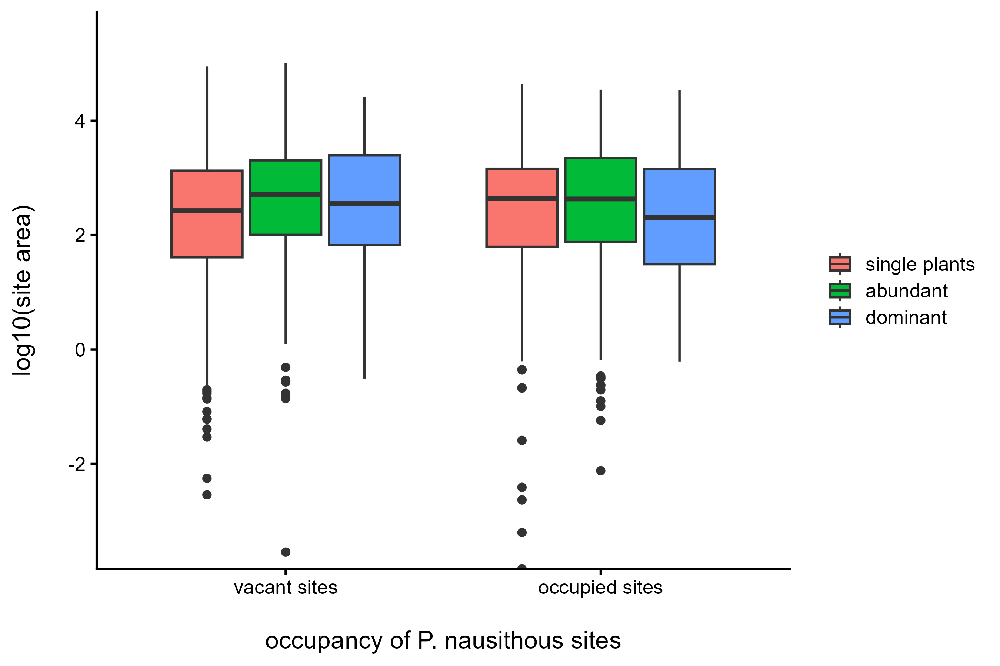
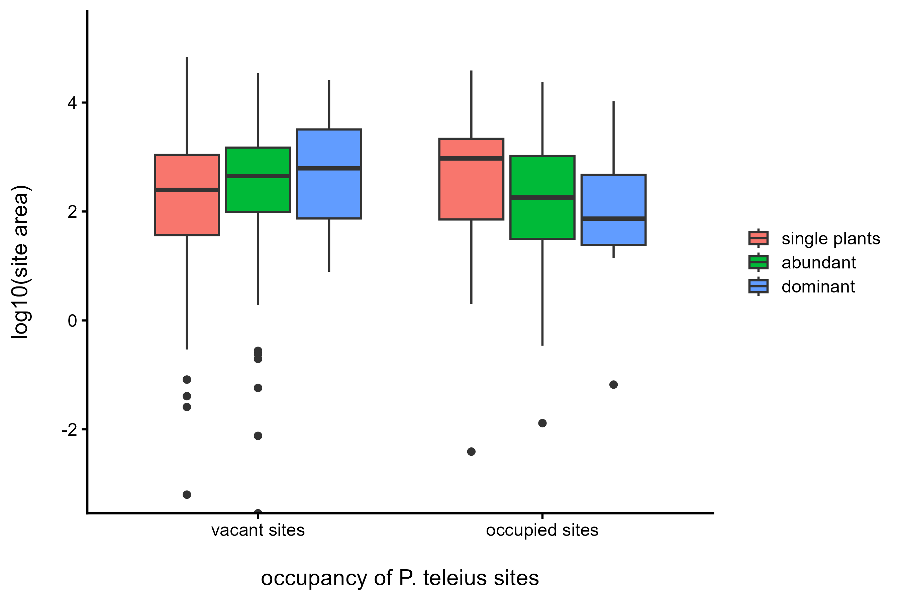
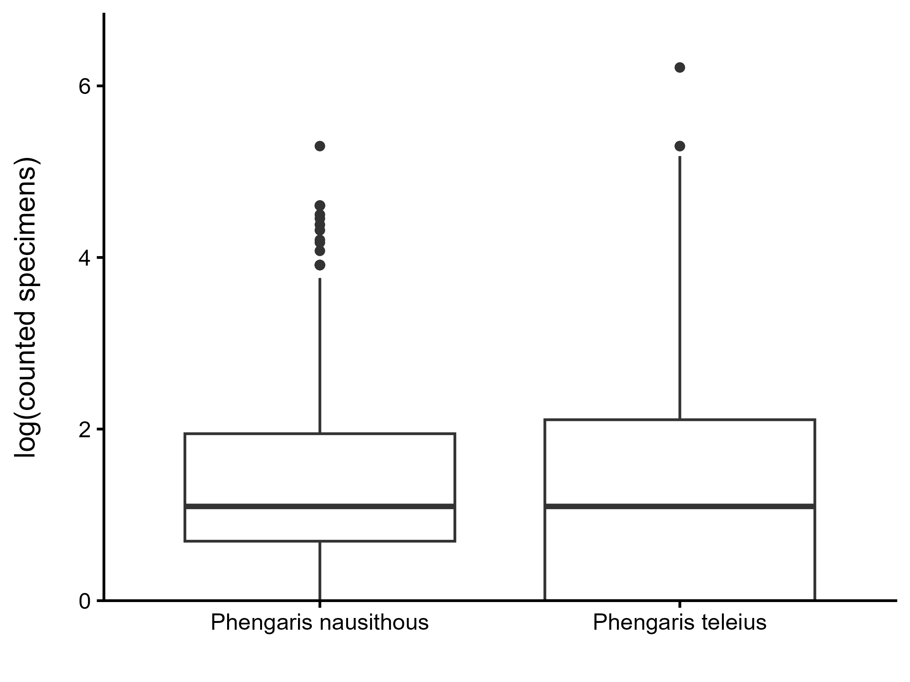
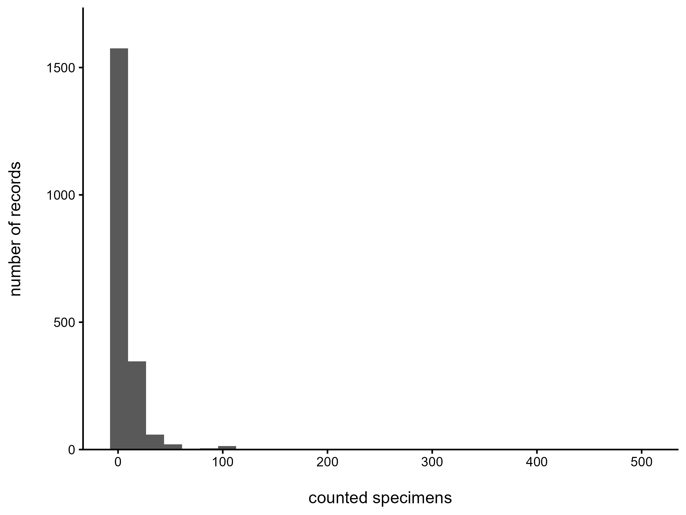
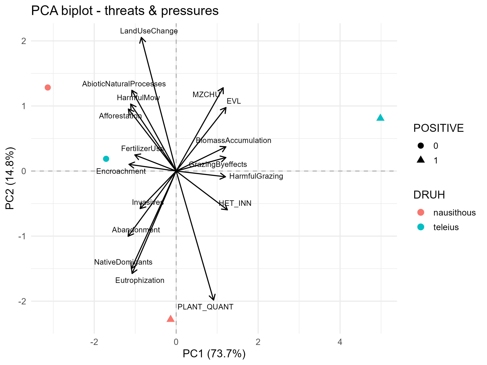
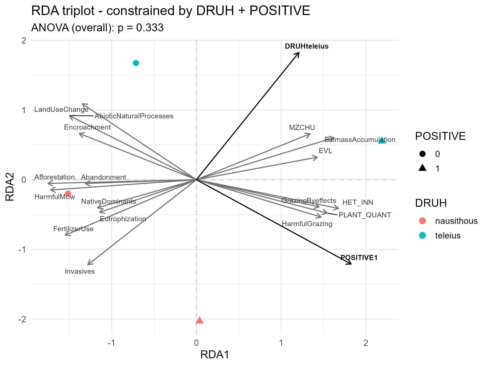
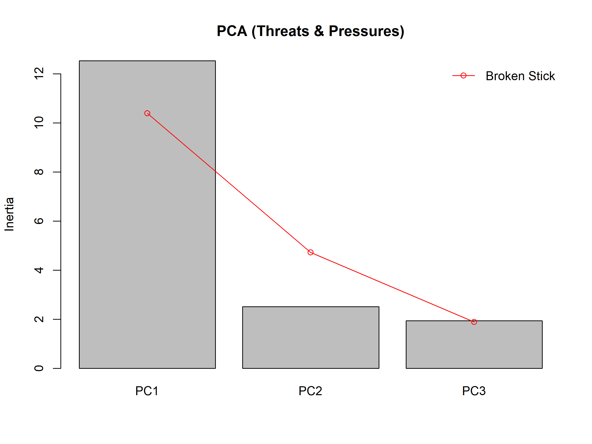
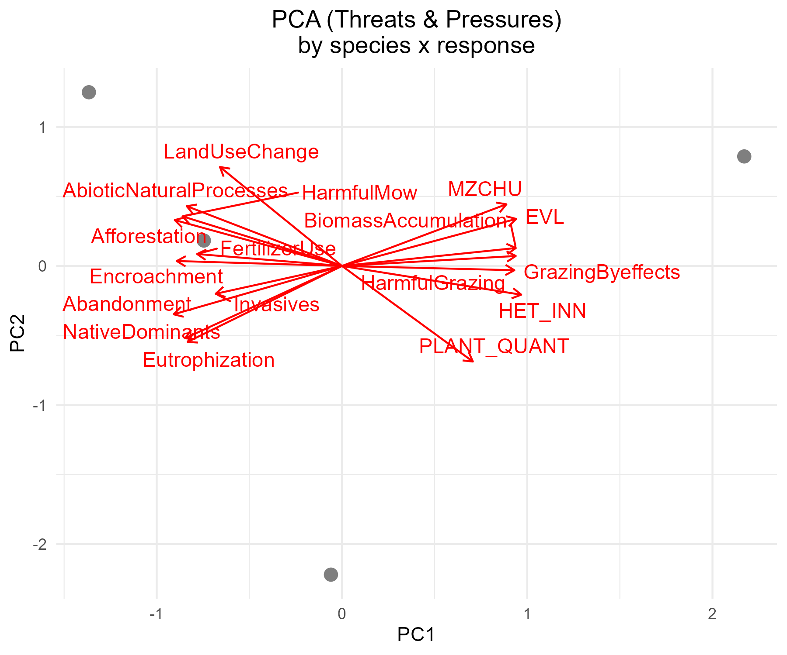
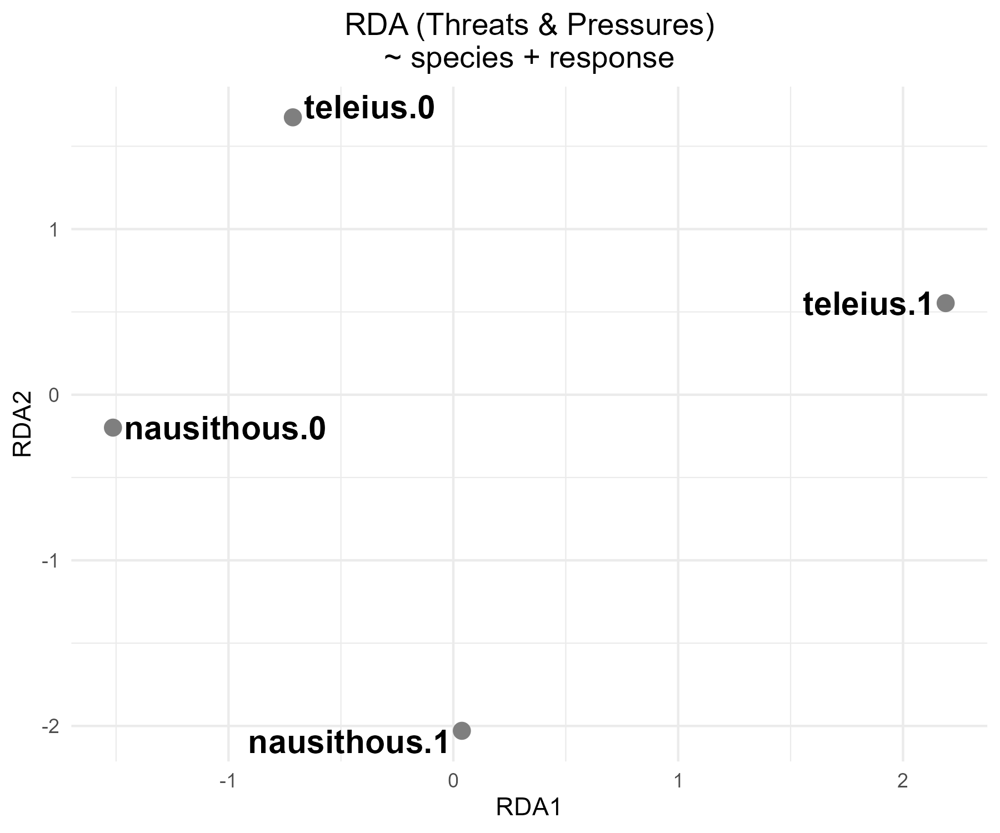

# Phengaris spp. management in Czechia - analysis report

_Compiled 2026-09-05 11:02:09_

Effects of grassland management on the occupancy of *Phengaris nausithous* and *Phengaris teleius* at monitored sites in Czechia, 2019-2024. Every table below is also written to `Outputs/Tables` as CSV and every figure to `Outputs/Figures` as PNG.

## Contents

1. [Step 04 - Cleaned occurrence data](#step-04---cleaned-occurrence-data)
2. [Step 06 - Habitat attributes](#step-06---habitat-attributes)
3. [Step 07 - Descriptive summaries](#step-07---descriptive-summaries)
4. [Step 08 - Descriptive figures](#step-08---descriptive-figures)
5. [Step 09 - Models P nausithous](#step-09---models-p-nausithous)
6. [Step 10 - Models P teleius](#step-10---models-p-teleius)
7. [Step 11 - Models both species](#step-11---models-both-species)
8. [Step 12 - Model figures](#step-12---model-figures)
9. [Step 13 - Threats and pressures](#step-13---threats-and-pressures)
10. [Step 14 - Maps](#step-14---maps)

---

# Step 04 - Cleaned occurrence data

_Generated 2026-09-05 10:53:50_

Derivation of the analysis variables from the targeted monitoring records. Only records from the targeted monitoring campaigns are kept, only records with the host plant present, and the two years with insufficient coverage are dropped.

**Table - Records retained at each filtering stage**

| stage | records |
|---|---|
| records with imputed absences (step 02) | 5409 |
| targeted monitoring only | 5409 |
| host plant present, excluded years dropped | 4540 |

Full table: [`04_cleaning_summary.csv`](Tables/04_cleaning_summary.csv)

**Table - Records flagged by each binary site attribute**

| variable | records_flagged | records_total | percent |
|---|---|---|---|
| EVL | 846 | 4540 | 18.6 |
| EVL_target | 372 | 4540 | 8.2 |
| MZCHU | 287 | 4540 | 6.3 |
| PROTECT | 928 | 4540 | 20.4 |
| SPEC_NUM | 105 | 4540 | 2.3 |

Full table: [`04_flag_counts.csv`](Tables/04_flag_counts.csv)

**Table - Visits covering both species**

| description | visits |
|---|---|
| visits at which both species were monitored | 1415 |
| visits at which both species were found | 113 |

Full table: [`04_both_species_visits.csv`](Tables/04_both_species_visits.csv)

## Corrections applied to the original code

> **Note.** MZCHU and SPEC_NUM were previously derived with `ID %in% <data frame>` rather than `ID %in% <vector of ids>`. Comparing against a data frame made both variables constant: in the previous `data_clean.csv` all 4540 records had MZCHU = 0 and SPEC_NUM = 0, and PROTECT was therefore an exact copy of EVL. Every model and figure using MZCHU, PROTECT or SPEC_NUM was fitted on a constant. Both now compare against the identifier vector.

The MZCHU flag now marks 287 of 4540 records as lying inside a small-scale specially protected area, and PROTECT is no longer identical to EVL.

> **Note.** SPEC_NUM keeps the original definition, which takes one ID_NALEZ per both-species visit, and so now flags 105 records. Defining it at the visit level instead, by matching site and date, would flag 239 records. Decide which of the two the co-occurrence model should use before the manuscript is finalised.

> **Note.** EVL_target keeps the original definition, under which a record is flagged when its site lies in a Natura 2000 site designated for either Phengaris species. It flags 372 records. The species-specific alternative could not be quantified because protected_area_id.csv predates the PA_SPECIES column; re-run step 03 to get that comparison.

---

# Step 06 - Habitat attributes

_Generated 2026-09-05 10:58:50_

The cleaned occurrence records joined to the habitat mapping layer, one habitat segment per record. This produces data_analysis.csv, the table every model in steps 09 to 11 is fitted on.

**Table - Coverage of the habitat variables in the analysis table**

| variable | records_with_value | records_total | percent |
|---|---|---|---|
| AREA_SITE | 4540 | 4540 | 100 |
| BIOTOP | 684 | 4540 | 15.1 |
| FSB | 4540 | 4540 | 100 |
| HET_OUT | 4540 | 4540 | 100 |

Full table: [`06_habitat_coverage.csv`](Tables/06_habitat_coverage.csv)

**Table - Mapped habitats at occupied P. nausithous sites**

| BIOTOP | AREA | mean_area | median_area | COUNT |
|---|---|---|---|---|
| -1 | 157.5 | 1280 | 25.11 | 1230 |
| T1.1 | 6.761 | 447.8 | 0 | 151 |
| T1.6 | 0.2823 | 100.8 | 0 | 28 |
| T1.9 | 0.2415 | 115 | 0 | 21 |
| L2.2 | 0.4092 | 292.3 | 0 | 14 |
| R2.2 | 0 | 0 | 0 | 4 |
| T1.2 | 0.3175 | 793.8 | 82.27 | 4 |
| L5.1 | 6.538e-05 | 0.2179 | 0 | 3 |
| T2.3B | 0 | 0 | 0 | 3 |
| L2.4 | 0.03412 | 170.6 | 170.6 | 2 |
| R2.1 | 0 | 0 | 0 | 2 |
| L10.2 | 0 | 0 | 0 | 1 |
| L2.3 | 0.0009515 | 9.515 | 9.515 | 1 |
| L3.1 | 0 | 0 | 0 | 1 |
| L3.3B | 0 | 0 | 0 | 1 |
| L4 | 0.004093 | 40.93 | 40.93 | 1 |
| V1F | 0 | 0 | 0 | 1 |
| V4A | 0 | 0 | 0 | 1 |

Full table: [`06_mapped_habitats_nausithous.csv`](Tables/06_mapped_habitats_nausithous.csv)

**Table - Mapped habitats at occupied P. teleius sites**

| BIOTOP | AREA | mean_area | median_area | COUNT |
|---|---|---|---|---|
| -1 | 23.3 | 1447 | 17.69 | 161 |
| T1.1 | 0.06219 | 27.04 | 0 | 23 |
| T1.9 | 0.03616 | 32.87 | 0 | 11 |
| T1.6 | 0 | 0 | 0 | 2 |
| T3.4D | 0.0003998 | 1.999 | 1.999 | 2 |
| R2.1 | 0 | 0 | 0 | 1 |
| T1.2 | 0.1823 | 1823 | 1823 | 1 |
| T2.3B | 0 | 0 | 0 | 1 |

Full table: [`06_mapped_habitats_teleius.csv`](Tables/06_mapped_habitats_teleius.csv)

**Figure - Catalogued habitats at occupied P. nausithous sites**

**Figure - Catalogued habitats at occupied P. teleius sites**

**Figure - Habitat area at occupied P. nausithous sites**

**Figure - Habitat area at occupied P. teleius sites**

## Segment selection rule

> **Note.** The rule is carried over unchanged from the original script: `arrange(NATURAL, AREA_SITE) %>% slice(1)`. Both keys sort ascending, so the segment kept for each record is the *least* natural and, among those, the *smallest*. If the intention was to describe each site by its most natural and largest habitat patch, the keys need `desc(NATURAL), desc(AREA_SITE)`. This was left as it stands because changing it would change every habitat model.

> **Note.** The direction of that sort has a large effect. NATURAL is defined by BIOTOP being present and not an X code, so ordering it ascending prefers a segment with no habitat code whenever the site has one. After the selection only 684 of 4540 records (15.1%) still carry a BIOTOP value, and the models using BIOTOP are fitted on that subset alone. Reversing the sort to `desc(NATURAL)` would keep the mapped habitat wherever one exists. This is a decision about the manuscript, not a bug, so the rule is left as written.

**Table - Selected segments: natural habitat flag against presence of a habitat code**

| NATURAL | BIOTOP_present | Freq |
|---|---|---|
| 0 | FALSE | 3856 |
| 1 | FALSE | 0 |
| 0 | TRUE | 0 |
| 1 | TRUE | 684 |

Full table: [`06_natural_vs_biotop.csv`](Tables/06_natural_vs_biotop.csv)

**Table - Records by whether the selected segment is a natural habitat**

| NATURAL | records |
|---|---|
| 0 | 3856 |
| 1 | 684 |

Full table: [`06_natural_habitat_share.csv`](Tables/06_natural_habitat_share.csv)

---

# Step 07 - Descriptive summaries

_Generated 2026-09-05 10:58:55_

Extent of the monitoring effort and the distribution of the analysis variables across records, species, years, observers, habitats, management and protection categories.

## General extent

**Table - Extent of the analysed data set**

| measure | value |
|---|---|
| records | 4540 |
| distinct localities | 3401 |
| distinct mapping fields | 364 |
| distinct observers | 80 |
| years covered | 6 |

Full table: [`07_data_extent.csv`](Tables/07_data_extent.csv)

**Table - Records by species and site occupancy**

| DRUH | POSITIVE | COUNT |
|---|---|---|
| Phengaris nausithous | 0 | 1747 |
| Phengaris nausithous | 1 | 1469 |
| Phengaris teleius | 0 | 1122 |
| Phengaris teleius | 1 | 202 |

Full table: [`07_occupancy_by_species.csv`](Tables/07_occupancy_by_species.csv)

**Table - Share of positive records by species and year**

| DRUH | YEAR | records | mean_positive |
|---|---|---|---|
| Phengaris nausithous | 2019 | 771 | 0.5357 |
| Phengaris nausithous | 2020 | 683 | 0.4451 |
| Phengaris nausithous | 2021 | 538 | 0.4294 |
| Phengaris nausithous | 2022 | 563 | 0.5719 |
| Phengaris nausithous | 2023 | 291 | 0.4158 |
| Phengaris nausithous | 2024 | 370 | 0.2108 |
| Phengaris teleius | 2019 | 211 | 0.1896 |
| Phengaris teleius | 2020 | 408 | 0.1495 |
| Phengaris teleius | 2021 | 173 | 0.2312 |
| Phengaris teleius | 2022 | 282 | 0.1312 |
| Phengaris teleius | 2023 | 118 | 0.1186 |
| Phengaris teleius | 2024 | 132 | 0.07576 |

Full table: [`07_positivity_by_year.csv`](Tables/07_positivity_by_year.csv)

**Table - Number of monitored years per locality**

| NAZ_LOKAL | roky |
|---|---|
| 5848d1 | 4 |
| 7151a1 | 4 |
| 5359a1 | 3 |
| 5848c1 | 3 |
| 5947a1 | 3 |
| 5947b1 | 3 |
| 6073d1 | 3 |
| 7051c1 | 3 |
| 7151a2 | 3 |
| 7151a3 | 3 |
| 7151a5 | 3 |
| 7254b1 | 3 |
| 7254b2 | 3 |
| 5352c1 | 2 |
| 5353c1 | 2 |
| 5359a2 | 2 |
| 5359d1 | 2 |
| 5457d1 | 2 |
| 5459b1 | 2 |
| 5556a1 | 2 |
| 5556b1 | 2 |
| 5848b1 | 2 |
| 5854a1 | 2 |
| 5857d2 | 2 |
| 5857d4 | 2 |

_Showing the first 25 of 2851 rows._

Full table: [`07_years_per_locality.csv`](Tables/07_years_per_locality.csv)

## Temporal coverage

**Table - Records by year and site occupancy**

| YEAR | POSITIVE | COUNT |
|---|---|---|
| 2019 | 0 | 529 |
| 2019 | 1 | 453 |
| 2020 | 0 | 726 |
| 2020 | 1 | 365 |
| 2021 | 0 | 440 |
| 2021 | 1 | 271 |
| 2022 | 0 | 486 |
| 2022 | 1 | 359 |
| 2023 | 0 | 274 |
| 2023 | 1 | 135 |
| 2024 | 0 | 414 |
| 2024 | 1 | 88 |

Full table: [`07_records_by_year.csv`](Tables/07_records_by_year.csv)

## Observers

**Table - Records per observer**

| AUTOR | obs_num |
|---|---|
| Papoušek Zdeněk | 772 |
| Tájek Přemysl | 342 |
| Beneš Jiří | 339 |
| Spitzer Lukáš | 299 |
| Waldhauser Martin | 202 |
| Fišer Marek | 192 |
| Švarc Jiří | 182 |
| Hrnčíř Jan | 160 |
| Dvořák Josef | 149 |
| Janáková Marie | 128 |
| Luka Václav | 127 |
| Valda Slávek | 119 |
| Jiří Švarc | 105 |
| Skála Jiří | 104 |
| Holec Vladislav | 88 |
| Janák Radek | 86 |
| Klimešová Kateřina | 83 |
| Slavomír Valda | 70 |
| Tomášek Václav | 70 |
| Křivan Václav | 62 |
| Ričl David | 58 |
| Moravec Pavel | 56 |
| Zapletal Michal | 55 |
| Machač Ondřej | 53 |
| Čtvrtečka Richard | 51 |

_Showing the first 25 of 80 rows._

Full table: [`07_records_per_observer.csv`](Tables/07_records_per_observer.csv)

80 observers contributed, with a mean of 56.8 and a median of 14 records each.

**Table - Mapping fields covered per observer and year**

| YEAR | AUTOR | fields |
|---|---|---|
| 2021 | Švarc Jiří | 30 |
| 2020 | Beneš Jiří | 21 |
| 2022 | Fišer Marek | 21 |
| 2021 | Tájek Přemysl | 17 |
| 2022 | Beneš Jiří | 15 |
| 2024 | Beneš Jiří | 15 |
| 2021 | Spitzer Lukáš | 13 |
| 2022 | Valda Slávek | 13 |
| 2023 | Beneš Jiří | 13 |
| 2023 | Spitzer Lukáš | 13 |
| 2019 | Waldhauser Martin | 12 |
| 2021 | Beneš Jiří | 12 |
| 2023 | Jiří Švarc | 11 |
| 2019 | Pavlíčko Alois | 10 |
| 2019 | Tájek Přemysl | 10 |
| 2020 | Hrnčíř Jan | 10 |
| 2020 | Spitzer Lukáš | 10 |
| 2022 | Papoušek Zdeněk | 10 |
| 2019 | Papoušek Zdeněk | 9 |
| 2020 | Dvořák Josef | 9 |
| 2020 | Klimešová Kateřina | 9 |
| 2021 | Klimešová Kateřina | 9 |
| 2024 | Fišer Marek | 9 |
| 2024 | Křivan Václav | 9 |
| 2019 | Dvořák Josef | 8 |

_Showing the first 25 of 155 rows._

Full table: [`07_fields_per_observer.csv`](Tables/07_fields_per_observer.csv)

**Table - Monitored sites per mapping field**

| SITMAP | sites |
|---|---|
| 5249 | 1 |
| 5259 | 1 |
| 5356 | 1 |
| 5645 | 1 |
| 5667 | 1 |
| 5749 | 1 |
| 5769 | 1 |
| 5868 | 1 |
| 6041 | 1 |
| 6043 | 1 |
| 6058 | 1 |
| 6065 | 1 |
| 6069 | 1 |
| 6262 | 1 |
| 6263 | 1 |
| 6275 | 1 |
| 6345 | 1 |
| 6354 | 1 |
| 6359 | 1 |
| 6360 | 1 |
| 6362 | 1 |
| 6363 | 1 |
| 6459 | 1 |
| 6552 | 1 |
| 6744 | 1 |

_Showing the first 25 of 364 rows._

Full table: [`07_sites_per_field.csv`](Tables/07_sites_per_field.csv)

## Occurrence and abundance

**Table - Records by occupancy, species and co-occurrence of the other species**

| POSITIVE | DRUH | SPEC_NUM | COUNT |
|---|---|---|---|
| 0 | Phengaris nausithous | 0 | 1747 |
| 0 | Phengaris teleius | 0 | 1122 |
| 1 | Phengaris nausithous | 0 | 1364 |
| 1 | Phengaris nausithous | 1 | 105 |
| 1 | Phengaris teleius | 0 | 202 |

Full table: [`07_species_cooccurrence.csv`](Tables/07_species_cooccurrence.csv)

**Table - Counted specimens per species**

| DRUH | records | mean | median | sd |
|---|---|---|---|---|
| Phengaris nausithous | 1467 | 7.015 | 3 | 12.15 |
| Phengaris teleius | 564 | 10.57 | 3 | 29.68 |

Full table: [`07_abundance_by_species.csv`](Tables/07_abundance_by_species.csv)

**Table - Mapping fields covered, overall and per occupied species**

| subset | mapping_fields |
|---|---|
| all monitored records | 364 |
| occupied P. nausithous records | 283 |
| occupied P. teleius records | 71 |

Full table: [`07_grid_coverage.csv`](Tables/07_grid_coverage.csv)

## Habitat and host plant

**Table - Recorded habitat types by species and occupancy**

| DRUH | POSITIVE | TTP | ZARUST | PRIKOP | JINY |
|---|---|---|---|---|---|
| Phengaris nausithous | 0 | 1108 | 457 | 198 | 217 |
| Phengaris nausithous | 1 | 946 | 370 | 176 | 164 |
| Phengaris teleius | 0 | 675 | 278 | 165 | 152 |
| Phengaris teleius | 1 | 156 | 43 | 15 | 15 |

Full table: [`07_habitat_type_counts.csv`](Tables/07_habitat_type_counts.csv)

**Table - Recorded habitats at occupied P. nausithous sites**

| name | COUNT | PERC |
|---|---|---|
| other | 164 | 11.16 |
| road verge, ditch | 176 | 11.98 |
| managed grassland | 946 | 64.4 |
| neglected grassland | 370 | 25.19 |

Full table: [`07_recorded_habitats_nausithous.csv`](Tables/07_recorded_habitats_nausithous.csv)

**Table - Recorded habitats at occupied P. teleius sites**

| name | COUNT | PERC |
|---|---|---|
| other | 15 | 7.426 |
| road verge, ditch | 15 | 7.426 |
| managed grassland | 156 | 77.23 |
| neglected grassland | 43 | 21.29 |

Full table: [`07_recorded_habitats_teleius.csv`](Tables/07_recorded_habitats_teleius.csv)

**Table - Host plant abundance by occupancy and species**

| POSITIVE | DRUH | PLANT_QUANT | COUNT |
|---|---|---|---|
| 0 | Phengaris nausithous | 1 | 1245 |
| 0 | Phengaris nausithous | 2 | 427 |
| 0 | Phengaris nausithous | 3 | 75 |
| 0 | Phengaris teleius | 1 | 699 |
| 0 | Phengaris teleius | 2 | 355 |
| 0 | Phengaris teleius | 3 | 68 |
| 1 | Phengaris nausithous | 1 | 734 |
| 1 | Phengaris nausithous | 2 | 619 |
| 1 | Phengaris nausithous | 3 | 116 |
| 1 | Phengaris teleius | 1 | 96 |
| 1 | Phengaris teleius | 2 | 86 |
| 1 | Phengaris teleius | 3 | 20 |

Full table: [`07_host_plant_abundance.csv`](Tables/07_host_plant_abundance.csv)

## Management

**Table - Records by mowing method**

| POSITIVE | DRUH | METHOD | COUNT |
|---|---|---|---|
| 0 | Phengaris nausithous | 0 | 519 |
| 0 | Phengaris nausithous | 1 | 431 |
| 0 | Phengaris nausithous |  | 797 |
| 0 | Phengaris teleius | 0 | 299 |
| 0 | Phengaris teleius | 1 | 293 |
| 0 | Phengaris teleius |  | 530 |
| 1 | Phengaris nausithous | 0 | 390 |
| 1 | Phengaris nausithous | 1 | 430 |
| 1 | Phengaris nausithous |  | 649 |
| 1 | Phengaris teleius | 0 | 46 |
| 1 | Phengaris teleius | 1 | 68 |
| 1 | Phengaris teleius |  | 88 |

Full table: [`07_management_method.csv`](Tables/07_management_method.csv)

**Table - Records by mowing timing**

| POSITIVE | DRUH | TIMING | COUNT |
|---|---|---|---|
| 0 | Phengaris nausithous | 0 | 389 |
| 0 | Phengaris nausithous | 1 | 583 |
| 0 | Phengaris nausithous |  | 775 |
| 0 | Phengaris teleius | 0 | 181 |
| 0 | Phengaris teleius | 1 | 440 |
| 0 | Phengaris teleius |  | 501 |
| 1 | Phengaris nausithous | 0 | 183 |
| 1 | Phengaris nausithous | 1 | 671 |
| 1 | Phengaris nausithous |  | 615 |
| 1 | Phengaris teleius | 0 | 19 |
| 1 | Phengaris teleius | 1 | 114 |
| 1 | Phengaris teleius |  | 69 |

Full table: [`07_management_timing.csv`](Tables/07_management_timing.csv)

**Table - Records by the combination of mowing method and timing**

| POSITIVE | DRUH | MANAGEMENT | COUNT |
|---|---|---|---|
| 0 | Phengaris nausithous | appropriate mow and appropriate timing | 330 |
| 0 | Phengaris nausithous | appropriate mow only | 97 |
| 0 | Phengaris nausithous | appropriate timing only | 229 |
| 0 | Phengaris nausithous | inappropriate mow and inappropriate timing | 287 |
| 0 | Phengaris nausithous |  | 804 |
| 0 | Phengaris teleius | appropriate mow and appropriate timing | 247 |
| 0 | Phengaris teleius | appropriate mow only | 44 |
| 0 | Phengaris teleius | appropriate timing only | 161 |
| 0 | Phengaris teleius | inappropriate mow and inappropriate timing | 134 |
| 0 | Phengaris teleius |  | 536 |
| 1 | Phengaris nausithous | appropriate mow and appropriate timing | 365 |
| 1 | Phengaris nausithous | appropriate mow only | 61 |
| 1 | Phengaris nausithous | appropriate timing only | 268 |
| 1 | Phengaris nausithous | inappropriate mow and inappropriate timing | 116 |
| 1 | Phengaris nausithous |  | 659 |
| 1 | Phengaris teleius | appropriate mow and appropriate timing | 61 |
| 1 | Phengaris teleius | appropriate mow only | 5 |
| 1 | Phengaris teleius | appropriate timing only | 33 |
| 1 | Phengaris teleius | inappropriate mow and inappropriate timing | 13 |
| 1 | Phengaris teleius |  | 90 |

Full table: [`07_management_combined.csv`](Tables/07_management_combined.csv)

**Table - Management recorded at occupied P. nausithous sites**

| name | COUNT | PERC |
|---|---|---|
| grazing | 35 | 2.383 |
| mowing | 864 | 58.82 |
| neglected grassland | 370 | 25.19 |

Full table: [`07_management_types_nausithous.csv`](Tables/07_management_types_nausithous.csv)

**Table - Management recorded at occupied P. teleius sites**

| name | COUNT | PERC |
|---|---|---|
| grazing | 9 | 4.455 |
| mowing | 135 | 66.83 |
| neglected grassland | 43 | 21.29 |

Full table: [`07_management_types_teleius.csv`](Tables/07_management_types_teleius.csv)

## Protected areas

**Table - Records by all protection variables**

| EVL | EVL_target | EVL_comb | MZCHU | POSITIVE | DRUH | COUNT |
|---|---|---|---|---|---|---|
| 0 | 0 | 0 | 0 | 0 | Phengaris nausithous | 1439 |
| 0 | 0 | 0 | 0 | 0 | Phengaris teleius | 929 |
| 0 | 0 | 0 | 0 | 1 | Phengaris nausithous | 1139 |
| 0 | 0 | 0 | 0 | 1 | Phengaris teleius | 105 |
| 0 | 0 | 0 | 1 | 0 | Phengaris nausithous | 30 |
| 0 | 0 | 0 | 1 | 0 | Phengaris teleius | 14 |
| 0 | 0 | 0 | 1 | 1 | Phengaris nausithous | 30 |
| 0 | 0 | 0 | 1 | 1 | Phengaris teleius | 8 |
| 1 | 0 | 0.5 | 0 | 0 | Phengaris nausithous | 109 |
| 1 | 0 | 0.5 | 0 | 0 | Phengaris teleius | 70 |
| 1 | 0 | 0.5 | 0 | 1 | Phengaris nausithous | 131 |
| 1 | 0 | 0.5 | 0 | 1 | Phengaris teleius | 33 |
| 1 | 0 | 0.5 | 1 | 0 | Phengaris nausithous | 51 |
| 1 | 0 | 0.5 | 1 | 0 | Phengaris teleius | 31 |
| 1 | 0 | 0.5 | 1 | 1 | Phengaris nausithous | 35 |
| 1 | 0 | 0.5 | 1 | 1 | Phengaris teleius | 14 |
| 1 | 1 | 1 | 0 | 0 | Phengaris nausithous | 100 |
| 1 | 1 | 1 | 0 | 0 | Phengaris teleius | 56 |
| 1 | 1 | 1 | 0 | 1 | Phengaris nausithous | 111 |
| 1 | 1 | 1 | 0 | 1 | Phengaris teleius | 31 |
| 1 | 1 | 1 | 1 | 0 | Phengaris nausithous | 18 |
| 1 | 1 | 1 | 1 | 0 | Phengaris teleius | 22 |
| 1 | 1 | 1 | 1 | 1 | Phengaris nausithous | 23 |
| 1 | 1 | 1 | 1 | 1 | Phengaris teleius | 11 |

Full table: [`07_protection_full.csv`](Tables/07_protection_full.csv)

**Table - Records by Natura 2000 membership**

| EVL | POSITIVE | DRUH | COUNT |
|---|---|---|---|
| 0 | 0 | Phengaris nausithous | 1469 |
| 0 | 0 | Phengaris teleius | 943 |
| 0 | 1 | Phengaris nausithous | 1169 |
| 0 | 1 | Phengaris teleius | 113 |
| 1 | 0 | Phengaris nausithous | 278 |
| 1 | 0 | Phengaris teleius | 179 |
| 1 | 1 | Phengaris nausithous | 300 |
| 1 | 1 | Phengaris teleius | 89 |

Full table: [`07_protection_evl.csv`](Tables/07_protection_evl.csv)

**Table - Records by Natura 2000 designation for Phengaris**

| EVL_target | POSITIVE | DRUH | COUNT |
|---|---|---|---|
| 0 | 0 | Phengaris nausithous | 1629 |
| 0 | 0 | Phengaris teleius | 1044 |
| 0 | 1 | Phengaris nausithous | 1335 |
| 0 | 1 | Phengaris teleius | 160 |
| 1 | 0 | Phengaris nausithous | 118 |
| 1 | 0 | Phengaris teleius | 78 |
| 1 | 1 | Phengaris nausithous | 134 |
| 1 | 1 | Phengaris teleius | 42 |

Full table: [`07_protection_evl_target.csv`](Tables/07_protection_evl_target.csv)

**Table - Records by combined Natura 2000 status**

| EVL_comb | POSITIVE | DRUH | COUNT |
|---|---|---|---|
| 0 | 0 | Phengaris nausithous | 1469 |
| 0 | 0 | Phengaris teleius | 943 |
| 0 | 1 | Phengaris nausithous | 1169 |
| 0 | 1 | Phengaris teleius | 113 |
| 0.5 | 0 | Phengaris nausithous | 160 |
| 0.5 | 0 | Phengaris teleius | 101 |
| 0.5 | 1 | Phengaris nausithous | 166 |
| 0.5 | 1 | Phengaris teleius | 47 |
| 1 | 0 | Phengaris nausithous | 118 |
| 1 | 0 | Phengaris teleius | 78 |
| 1 | 1 | Phengaris nausithous | 134 |
| 1 | 1 | Phengaris teleius | 42 |

Full table: [`07_protection_evl_combined.csv`](Tables/07_protection_evl_combined.csv)

**Table - Records by small-scale protected area membership**

| MZCHU | POSITIVE | DRUH | COUNT |
|---|---|---|---|
| 0 | 0 | Phengaris nausithous | 1648 |
| 0 | 0 | Phengaris teleius | 1055 |
| 0 | 1 | Phengaris nausithous | 1381 |
| 0 | 1 | Phengaris teleius | 169 |
| 1 | 0 | Phengaris nausithous | 99 |
| 1 | 0 | Phengaris teleius | 67 |
| 1 | 1 | Phengaris nausithous | 88 |
| 1 | 1 | Phengaris teleius | 33 |

Full table: [`07_protection_mzchu.csv`](Tables/07_protection_mzchu.csv)

**Table - Occupancy per species and range polygon**

| DRUH | POSITIVE | row_n |
|---|---|---|
| Phengaris nausithous | 1 | 2 |
| Phengaris nausithous | 1 | 4 |
| Phengaris nausithous | 0 | 5 |
| Phengaris nausithous | 1 | 8 |
| Phengaris nausithous | 1 | 13 |
| Phengaris nausithous | 1 | 14 |
| Phengaris nausithous | 1 | 16 |
| Phengaris nausithous | 1 | 17 |
| Phengaris nausithous | 1 | 18 |
| Phengaris nausithous | 1 | 21 |
| Phengaris nausithous | 1 | 22 |
| Phengaris nausithous | 0 | 23 |
| Phengaris nausithous | 0 | 24 |
| Phengaris nausithous | 1 | 25 |
| Phengaris nausithous | 1 | 26 |
| Phengaris nausithous | 1 | 27 |
| Phengaris nausithous | 1 | 28 |
| Phengaris nausithous | 1 | 29 |
| Phengaris nausithous | 1 | 30 |
| Phengaris nausithous | 1 | 31 |
| Phengaris nausithous | 1 | 32 |
| Phengaris nausithous | 1 | 35 |
| Phengaris nausithous | 1 | 36 |
| Phengaris nausithous | 0 | 37 |
| Phengaris nausithous | 1 | 39 |

_Showing the first 25 of 737 rows._

Full table: [`07_mapping_fields.csv`](Tables/07_mapping_fields.csv)

---

# Step 08 - Descriptive figures

_Generated 2026-09-05 10:58:56_

Figures describing the monitoring effort and the distribution of the analysis variables. Site occupancy is shown with the same two greys throughout: light grey for records without the species, dark grey for records with it.

## General and temporal

**Figure - Site occupancy by species**

**Figure - Records per year and site occupancy**

## Observers

**Figure - Distribution of record counts per observer**

## Occurrence patterns

**Figure - Records of each species without the other species present**

## Host plant

**Figure - Host plant abundance, P. nausithous**

**Figure - Host plant abundance, P. teleius**

## Recorded habitats

**Figure - Recorded habitats at occupied P. nausithous sites**

**Figure - Recorded habitats at occupied P. teleius sites**

## Management

**Figure - Management appropriateness, P. nausithous**

**Figure - Management appropriateness, P. teleius**

**Figure - Management types, P. nausithous**

**Figure - Management types, P. teleius**

## Protected areas

**Figure - Natura 2000 membership, P. nausithous**

**Figure - Natura 2000 membership, P. teleius**

**Figure - Natura 2000 designation, P. nausithous**

**Figure - Natura 2000 designation, P. teleius**

**Figure - Combined Natura 2000 status, P. nausithous**

**Figure - Combined Natura 2000 status, P. teleius**

**Figure - Small-scale protected areas, P. nausithous**

**Figure - Small-scale protected areas, P. teleius**

---

# Step 09 - Models P nausithous

_Generated 2026-09-05 10:59:06_

Binomial occupancy models for Phengaris nausithous, grouped by the hypothesis each set addresses: baseline space and time, habitat extent and host plant, management, and conservation status.

**Table - Model fit statistics**

| model | label | group | engine | n_obs | AIC | BIC | logLik | deviance | df | status |
|---|---|---|---|---|---|---|---|---|---|---|
| nau_null | Null model with year and site random effects | Baseline | glmer | 3216 | 4311 | 4329 | -2152 | 3902 | 3 | ok |
| nau_year_factor | Year as a factor | Baseline | glm | 3216 | 4296 | 4332 | -2142 | 4284 | 6 | ok |
| nau_year_linear | Year as a linear trend | Baseline | glm | 3216 | 4383 | 4395 | -2190 | 4379 | 2 | ok |
| nau_year_poly | Year as a quadratic trend | Baseline | glm | 3216 | 4361 | 4379 | -2177 | 4355 | 3 | ok |
| nau_spatial | Spatial position | Baseline | glm | 3216 | 4426 | 4438 | -2211 | 4422 | 2 | ok |
| nau_spatiotemporal | Year and spatial position | Baseline | glm | 3216 | 4279 | 4322 | -2133 | 4265 | 7 | ok |
| nau_area_null | Null model on records with a positive site area | Habitat | glmer | 1805 | 2318 | 2335 | -1156 | 1986 | 3 | ok |
| nau_area | Site area | Habitat | glmer | 1805 | 2319 | 2341 | -1155 | 1989 | 4 | ok |
| nau_area_null_glm | Intercept-only model on records with a known site area | Habitat | glm | 3216 | 4436 | 4442 | -2217 | 4434 | 1 | ok |
| nau_area_poly | Site area, quadratic | Habitat | glmer | 1805 | 2320 | 2348 | -1155 | 1989 | 5 | ok |
| nau_plant | Host plant abundance | Habitat | glmer | 1805 | 2267 | 2289 | -1130 | 1890 | 4 | ok |
| nau_plant_poly | Host plant abundance, quadratic | Habitat | glmer | 3216 | 4182 | 4213 | -2086 | 3730 | 5 | ok |
| nau_resource_density | Site area by host plant abundance | Habitat | glmer | 1805 | 2269 | 2302 | -1128 | 1888 | 6 | ok |
| nau_mow_null | Null model on records where mowing was assessed | Management | glmer | 1753 | 2363 | 2380 | -1179 | 2085 | 3 | ok |
| nau_timing | Mowing timing | Management | glmer | 1753 | 2296 | 2318 | -1144 | 1981 | 4 | ok |
| nau_method | Mowing method | Management | glmer | 1753 | 2356 | 2378 | -1174 | 2072 | 4 | ok |
| nau_method_timing | Mowing method by timing (selected management model) | Management | glmer | 1753 | 2295 | 2328 | -1141 | 1969 | 6 | ok |
| nau_mow_null_glm | Intercept-only model on records where mowing was assessed | Management | glm | 1753 | 2422 | 2428 | -1210 | 2420 | 1 | ok |
| nau_graze_null | Null model on records where grazing was assessed | Management | glmer | 77 | 111.5 | 118.6 | -52.77 | 95.73 | 3 | ok |
| nau_graze | Grazing present | Management | glmer | 3216 | 4312 | 4337 | -2152 | 3901 | 4 | ok |
| nau_graze_method | Grazing intensity | Management | glmer | 77 | 113.2 | 122.6 | -52.59 | 95.62 | 4 | ok |
| nau_management_het | Mowing timing by method by within-site heterogeneity | Management | glmer | 1753 | 2301 | 2355 | -1140 | 1965 | 10 | fitted with warnings |
| nau_protect | Any protection | Conservation | glmer | 3216 | 4300 | 4325 | -2146 | 3881 | 4 | ok |
| nau_evl | Natura 2000 membership | Conservation | glmer | 3216 | 4302 | 4326 | -2147 | 3885 | 4 | ok |
| nau_evl_target | Natura 2000 designated for Phengaris | Conservation | glmer | 3216 | 4307 | 4331 | -2149 | 3892 | 4 | ok |
| nau_evl_combined | Natura 2000 membership and designation (selected protection model) | Conservation | glmer | 3216 | 4303 | 4334 | -2147 | 3884 | 5 | ok |
| nau_evl_year | Natura 2000 membership by year | Conservation | glmer | 3216 | 4373 | 4404 | -2182 | 3971 | 5 | fitted with warnings |
| nau_mzchu | Small-scale protected area | Conservation | glmer | 3216 | 4312 | 4337 | -2152 | 3900 | 4 | ok |
| nau_mzchu_evl | Small-scale protected area by Natura 2000 | Conservation | glmer | 3216 | 4302 | 4338 | -2145 | 3881 | 6 | ok |
| nau_ttp | Regularly managed grassland | Conservation | glmer | 3195 | 4283 | 4308 | -2138 | 3871 | 4 | ok |
| nau_management_ttp | Mowing timing by method by grassland type | Conservation | glmer | 1752 | 2292 | 2330 | -1139 | 1964 | 7 | fitted with warnings |
| nau_fsb | Habitat quality evaluation | Conservation | glmer | 3216 | 4299 | 4366 | -2139 | 3873 | 11 | ok |
| nau_het_inner | Within-site habitat heterogeneity | Conservation | glmer | 3216 | 4314 | 4344 | -2152 | 3900 | 5 | ok |
| nau_het_outer | Between-habitat heterogeneity | Conservation | glmer | 3216 | 4310 | 4334 | -2151 | 3899 | 4 | ok |
| nau_threats | Number of threats and pressures | Conservation | glmer | 1805 | 2313 | 2335 | -1153 | 1969 | 4 | ok |

Full table: [`09_nausithous_fit_statistics.csv`](Tables/09_nausithous_fit_statistics.csv)

**Table - Fixed-effect coefficients**

| model | label | term | estimate | std_error | statistic | p_value |
|---|---|---|---|---|---|---|
| nau_null | Null model with year and site random effects | (Intercept) | -0.2973 | 0.2199 | -1.352 | 0.1765 |
| nau_year_factor | Year as a factor | (Intercept) | 0.1429 | 0.07221 | 1.979 | 0.04781 |
| nau_year_factor | Year as a factor | as.factor(YEAR)2020 | -0.3634 | 0.1056 | -3.443 | 0.0005756 |
| nau_year_factor | Year as a factor | as.factor(YEAR)2021 | -0.4273 | 0.1131 | -3.777 | 0.0001587 |
| nau_year_factor | Year as a factor | as.factor(YEAR)2022 | 0.1468 | 0.1117 | 1.315 | 0.1885 |
| nau_year_factor | Year as a factor | as.factor(YEAR)2023 | -0.4829 | 0.1391 | -3.471 | 0.0005192 |
| nau_year_factor | Year as a factor | as.factor(YEAR)2024 | -1.463 | 0.1465 | -9.987 | 1.744e-23 |
| nau_year_linear | Year as a linear trend | (Intercept) | 324.1 | 44.14 | 7.342 | 2.109e-13 |
| nau_year_linear | Year as a linear trend | as.numeric(YEAR) | -0.1604 | 0.02184 | -7.346 | 2.05e-13 |
| nau_year_poly | Year as a quadratic trend | (Intercept) | -0.1823 | 0.03592 | -5.076 | 3.853e-07 |
| nau_year_poly | Year as a quadratic trend | poly(as.numeric(YEAR), 2)1 | -15.65 | 2.103 | -7.441 | 9.981e-14 |
| nau_year_poly | Year as a quadratic trend | poly(as.numeric(YEAR), 2)2 | -10.24 | 2.084 | -4.917 | 8.806e-07 |
| nau_spatial | Spatial position | (Intercept) | 0.09164 | 0.0827 | 1.108 | 0.2678 |
| nau_spatial | Spatial position | X:Y | -4.293e-17 | 1.212e-17 | -3.542 | 0.0003969 |
| nau_spatiotemporal | Year and spatial position | (Intercept) | 0.4946 | 0.1103 | 4.486 | 7.272e-06 |
| nau_spatiotemporal | Year and spatial position | as.factor(YEAR)2020 | -0.3997 | 0.1063 | -3.761 | 0.0001691 |
| nau_spatiotemporal | Year and spatial position | as.factor(YEAR)2021 | -0.4589 | 0.1138 | -4.034 | 5.489e-05 |
| nau_spatiotemporal | Year and spatial position | as.factor(YEAR)2022 | 0.1266 | 0.1121 | 1.129 | 0.2588 |
| nau_spatiotemporal | Year and spatial position | as.factor(YEAR)2023 | -0.5206 | 0.1398 | -3.723 | 0.0001968 |
| nau_spatiotemporal | Year and spatial position | as.factor(YEAR)2024 | -1.502 | 0.1473 | -10.2 | 1.92e-24 |
| nau_spatiotemporal | Year and spatial position | X:Y | -5.305e-17 | 1.249e-17 | -4.248 | 2.161e-05 |
| nau_area_null | Null model on records with a positive site area | (Intercept) | 0.1513 | 0.8203 | 0.1845 | 0.8537 |
| nau_area | Site area | (Intercept) | -0.0001637 | 0.8313 | -0.0001969 | 0.9998 |
| nau_area | Site area | log10(AREA_SITE) | 0.06323 | 0.04654 | 1.359 | 0.1742 |
| nau_area_null_glm | Intercept-only model on records with a known site area | (Intercept) | -0.1733 | 0.0354 | -4.896 | 9.779e-07 |
| nau_area_poly | Site area, quadratic | (Intercept) | 0.1516 | 0.8251 | 0.1838 | 0.8542 |
| nau_area_poly | Site area, quadratic | poly(log10(AREA_SITE), 2)1 | 3.144 | 2.31 | 1.361 | 0.1736 |
| nau_area_poly | Site area, quadratic | poly(log10(AREA_SITE), 2)2 | 1.264 | 2.302 | 0.5493 | 0.5828 |
| nau_plant | Host plant abundance | (Intercept) | -0.8292 | 0.8133 | -1.02 | 0.3079 |
| nau_plant | Host plant abundance | PLANT_QUANT | 0.6704 | 0.09813 | 6.832 | 8.396e-12 |
| nau_plant_poly | Host plant abundance, quadratic | (Intercept) | -0.2931 | 0.2097 | -1.398 | 0.1621 |
| nau_plant_poly | Host plant abundance, quadratic | poly(PLANT_QUANT, 2)1 | 24.12 | 2.411 | 10.01 | 1.408e-23 |
| nau_plant_poly | Host plant abundance, quadratic | poly(PLANT_QUANT, 2)2 | -8.904 | 2.247 | -3.963 | 7.412e-05 |
| nau_resource_density | Site area by host plant abundance | (Intercept) | -1.307 | 0.8712 | -1.5 | 0.1336 |
| nau_resource_density | Site area by host plant abundance | log(AREA_SITE) | 0.0866 | 0.05468 | 1.584 | 0.1132 |
| nau_resource_density | Site area by host plant abundance | as.numeric(PLANT_QUANT) | 0.9327 | 0.2222 | 4.198 | 2.695e-05 |
| nau_resource_density | Site area by host plant abundance | log(AREA_SITE):as.numeric(PLANT_QUANT) | -0.04747 | 0.03474 | -1.366 | 0.1718 |
| nau_mow_null | Null model on records where mowing was assessed | (Intercept) | -0.2487 | 0.2198 | -1.132 | 0.2578 |
| nau_timing | Mowing timing | (Intercept) | -0.9405 | 0.2399 | -3.92 | 8.849e-05 |
| nau_timing | Mowing timing | as.factor(TIMING)1 | 0.99 | 0.1288 | 7.688 | 1.49e-14 |
| nau_method | Mowing method | (Intercept) | -0.4075 | 0.2285 | -1.783 | 0.07456 |
| nau_method | Mowing method | as.factor(METHOD)1 | 0.3311 | 0.1091 | 3.034 | 0.00241 |
| nau_method_timing | Mowing method by timing (selected management model) | (Intercept) | -1.091 | 0.2516 | -4.336 | 1.453e-05 |
| nau_method_timing | Mowing method by timing (selected management model) | as.factor(METHOD)1 | 0.4974 | 0.2201 | 2.26 | 0.02383 |
| nau_method_timing | Mowing method by timing (selected management model) | as.factor(TIMING)1 | 1.162 | 0.1672 | 6.948 | 3.692e-12 |
| nau_method_timing | Mowing method by timing (selected management model) | as.factor(METHOD)1:as.factor(TIMING)1 | -0.5338 | 0.2576 | -2.073 | 0.0382 |
| nau_mow_null_glm | Intercept-only model on records where mowing was assessed | (Intercept) | -0.152 | 0.04791 | -3.174 | 0.001506 |
| nau_graze_null | Null model on records where grazing was assessed | (Intercept) | -0.2432 | 0.2384 | -1.02 | 0.3076 |
| nau_graze | Grazing present | (Intercept) | -0.3004 | 0.2205 | -1.362 | 0.1731 |
| nau_graze | Grazing present | as.factor(GRAZE)1 | 0.1071 | 0.2556 | 0.4191 | 0.6751 |
| nau_graze_method | Grazing intensity | (Intercept) | -0.5492 | 0.6277 | -0.875 | 0.3816 |
| nau_graze_method | Grazing intensity | as.factor(GRAZE_MET)1 | 0.3767 | 0.6523 | 0.5774 | 0.5636 |
| nau_management_het | Mowing timing by method by within-site heterogeneity | (Intercept) | -0.8353 | 0.3777 | -2.212 | 0.027 |
| nau_management_het | Mowing timing by method by within-site heterogeneity | as.factor(TIMING)1 | 0.6414 | 0.5313 | 1.207 | 0.2273 |
| nau_management_het | Mowing timing by method by within-site heterogeneity | as.factor(METHOD)1 | -0.1657 | 0.5503 | -0.301 | 0.7634 |
| nau_management_het | Mowing timing by method by within-site heterogeneity | HET_INN | -0.1939 | 0.2177 | -0.8907 | 0.3731 |
| nau_management_het | Mowing timing by method by within-site heterogeneity | as.factor(TIMING)1:as.factor(METHOD)1 | 0.4487 | 0.7295 | 0.615 | 0.5385 |
| nau_management_het | Mowing timing by method by within-site heterogeneity | as.factor(TIMING)1:HET_INN | 0.4406 | 0.4463 | 0.9871 | 0.3236 |
| nau_management_het | Mowing timing by method by within-site heterogeneity | as.factor(METHOD)1:HET_INN | 0.459 | 0.3477 | 1.32 | 0.1868 |
| nau_management_het | Mowing timing by method by within-site heterogeneity | as.factor(TIMING)1:as.factor(METHOD)1:HET_INN | -0.7461 | 0.5416 | -1.377 | 0.1684 |
| nau_protect | Any protection | (Intercept) | -0.3652 | 0.2223 | -1.643 | 0.1003 |
| nau_protect | Any protection | as.factor(PROTECT)1 | 0.3383 | 0.0975 | 3.47 | 0.0005214 |
| nau_evl | Natura 2000 membership | (Intercept) | -0.358 | 0.2218 | -1.614 | 0.1066 |
| nau_evl | Natura 2000 membership | as.factor(EVL)1 | 0.3347 | 0.1012 | 3.307 | 0.0009427 |
| nau_evl_target | Natura 2000 designated for Phengaris | (Intercept) | -0.3258 | 0.2213 | -1.472 | 0.141 |
| nau_evl_target | Natura 2000 designated for Phengaris | as.factor(EVL_target)1 | 0.3564 | 0.1459 | 2.442 | 0.01459 |
| nau_evl_combined | Natura 2000 membership and designation (selected protection model) | (Intercept) | -0.3582 | 0.222 | -1.614 | 0.1066 |
| nau_evl_combined | Natura 2000 membership and designation (selected protection model) | as.factor(EVL)1 | 0.2947 | 0.1282 | 2.299 | 0.0215 |
| nau_evl_combined | Natura 2000 membership and designation (selected protection model) | as.factor(EVL_target)1 | 0.09401 | 0.1848 | 0.5087 | 0.6109 |
| nau_evl_year | Natura 2000 membership by year | (Intercept) | 360.5 | 0.6547 | 550.7 | 0 |
| nau_evl_year | Natura 2000 membership by year | as.factor(EVL)1 | -101 | 1.565 | -64.49 | 0 |
| nau_evl_year | Natura 2000 membership by year | as.numeric(YEAR) | -0.1785 | 0.0003239 | -551 | 0 |
| nau_evl_year | Natura 2000 membership by year | as.factor(EVL)1:as.numeric(YEAR) | 0.05011 | 0.0007747 | 64.68 | 0 |
| nau_mzchu | Small-scale protected area | (Intercept) | -0.3026 | 0.2203 | -1.373 | 0.1696 |
| nau_mzchu | Small-scale protected area | as.factor(MZCHU)1 | 0.08507 | 0.1647 | 0.5164 | 0.6056 |
| nau_mzchu_evl | Small-scale protected area by Natura 2000 | (Intercept) | -0.3641 | 0.2225 | -1.637 | 0.1017 |
| nau_mzchu_evl | Small-scale protected area by Natura 2000 | as.factor(MZCHU)1 | 0.3042 | 0.2835 | 1.073 | 0.2832 |
| nau_mzchu_evl | Small-scale protected area by Natura 2000 | as.factor(EVL)1 | 0.4189 | 0.1129 | 3.711 | 0.0002068 |
| nau_mzchu_evl | Small-scale protected area by Natura 2000 | as.factor(MZCHU)1:as.factor(EVL)1 | -0.654 | 0.3597 | -1.818 | 0.06903 |
| nau_ttp | Regularly managed grassland | (Intercept) | -0.3482 | 0.2264 | -1.538 | 0.124 |
| nau_ttp | Regularly managed grassland | as.factor(TTP)1 | 0.07393 | 0.08089 | 0.914 | 0.3607 |
| nau_management_ttp | Mowing timing by method by grassland type | (Intercept) | 12.06 | 628 | 0.01921 | 0.9847 |
| nau_management_ttp | Mowing timing by method by grassland type | as.factor(TIMING)1 | 1.167 | 0.1542 | 7.568 | 3.793e-14 |
| nau_management_ttp | Mowing timing by method by grassland type | as.factor(METHOD)1 | 0.5093 | 0.2126 | 2.395 | 0.01662 |
| nau_management_ttp | Mowing timing by method by grassland type | as.factor(TTP)1 | -13.17 | 628 | -0.02097 | 0.9833 |
| nau_management_ttp | Mowing timing by method by grassland type | as.factor(TIMING)1:as.factor(METHOD)1 | -0.5378 | 0.2484 | -2.165 | 0.03036 |
| nau_fsb | Habitat quality evaluation | (Intercept) | -0.3954 | 0.2172 | -1.821 | 0.06866 |
| nau_fsb | Habitat quality evaluation | as.factor(FSB)K | -0.5255 | 0.2729 | -1.925 | 0.05417 |
| nau_fsb | Habitat quality evaluation | as.factor(FSB)L | -0.2289 | 0.3123 | -0.7329 | 0.4636 |
| nau_fsb | Habitat quality evaluation | as.factor(FSB)M | -0.4393 | 0.333 | -1.319 | 0.187 |
| nau_fsb | Habitat quality evaluation | as.factor(FSB)moz. | 0.06992 | 0.152 | 0.4599 | 0.6456 |
| nau_fsb | Habitat quality evaluation | as.factor(FSB)R | -0.184 | 0.819 | -0.2246 | 0.8223 |
| nau_fsb | Habitat quality evaluation | as.factor(FSB)T | 0.3158 | 0.1041 | 3.034 | 0.002417 |
| nau_fsb | Habitat quality evaluation | as.factor(FSB)V | -0.5566 | 0.496 | -1.122 | 0.2619 |
| nau_fsb | Habitat quality evaluation | as.factor(FSB)X | 0.3366 | 0.1087 | 3.096 | 0.001962 |
| nau_het_inner | Within-site habitat heterogeneity | (Intercept) | -0.2315 | 0.2331 | -0.9929 | 0.3208 |
| nau_het_inner | Within-site habitat heterogeneity | HET_INN | -0.05982 | 0.06886 | -0.8688 | 0.385 |
| nau_het_outer | Between-habitat heterogeneity | (Intercept) | -0.1369 | 0.2418 | -0.566 | 0.5714 |
| nau_het_outer | Between-habitat heterogeneity | as.numeric(HET_OUT) | -0.1461 | 0.0916 | -1.595 | 0.1106 |
| nau_threats | Number of threats and pressures | (Intercept) | 0.2679 | 0.8056 | 0.3325 | 0.7395 |
| nau_threats | Number of threats and pressures | SUM_THREATS | -0.1021 | 0.03845 | -2.654 | 0.007944 |

Full table: [`09_nausithous_coefficients.csv`](Tables/09_nausithous_coefficients.csv)

**Table - Random-effect variances**

| model | label | group | term | variance | sd |
|---|---|---|---|---|---|
| nau_null | Null model with year and site random effects | X:Y | (Intercept) | 0.2608 | 0.5107 |
| nau_null | Null model with year and site random effects | YEAR | (Intercept) | 0.2797 | 0.5289 |
| nau_area_null | Null model on records with a positive site area | X:Y | (Intercept) | 0.4004 | 0.6328 |
| nau_area_null | Null model on records with a positive site area | YEAR | (Intercept) | 3.734 | 1.932 |
| nau_area | Site area | X:Y | (Intercept) | 0.3932 | 0.6271 |
| nau_area | Site area | YEAR | (Intercept) | 3.754 | 1.938 |
| nau_area_poly | Site area, quadratic | X:Y | (Intercept) | 0.3927 | 0.6266 |
| nau_area_poly | Site area, quadratic | YEAR | (Intercept) | 3.768 | 1.941 |
| nau_plant | Host plant abundance | X:Y | (Intercept) | 0.4843 | 0.6959 |
| nau_plant | Host plant abundance | YEAR | (Intercept) | 3.531 | 1.879 |
| nau_plant_poly | Host plant abundance, quadratic | X:Y | (Intercept) | 0.3051 | 0.5524 |
| nau_plant_poly | Host plant abundance, quadratic | YEAR | (Intercept) | 0.2525 | 0.5025 |
| nau_resource_density | Site area by host plant abundance | X:Y | (Intercept) | 0.4845 | 0.696 |
| nau_resource_density | Site area by host plant abundance | YEAR | (Intercept) | 3.552 | 1.885 |
| nau_mow_null | Null model on records where mowing was assessed | X:Y | (Intercept) | 0.3223 | 0.5677 |
| nau_mow_null | Null model on records where mowing was assessed | YEAR | (Intercept) | 0.2705 | 0.5201 |
| nau_timing | Mowing timing | X:Y | (Intercept) | 0.3889 | 0.6236 |
| nau_timing | Mowing timing | YEAR | (Intercept) | 0.2719 | 0.5214 |
| nau_method | Mowing method | X:Y | (Intercept) | 0.3283 | 0.573 |
| nau_method | Mowing method | YEAR | (Intercept) | 0.2767 | 0.526 |
| nau_method_timing | Mowing method by timing (selected management model) | X:Y | (Intercept) | 0.4003 | 0.6327 |
| nau_method_timing | Mowing method by timing (selected management model) | YEAR | (Intercept) | 0.2745 | 0.5239 |
| nau_graze_null | Null model on records where grazing was assessed | X:Y | (Intercept) | 0.2752 | 0.5246 |
| nau_graze_null | Null model on records where grazing was assessed | YEAR | (Intercept) | 0 | 0 |
| nau_graze | Grazing present | X:Y | (Intercept) | 0.2616 | 0.5115 |
| nau_graze | Grazing present | YEAR | (Intercept) | 0.2807 | 0.5299 |
| nau_graze_method | Grazing intensity | X:Y | (Intercept) | 0.2598 | 0.5097 |
| nau_graze_method | Grazing intensity | YEAR | (Intercept) | 0.009537 | 0.09766 |
| nau_management_het | Mowing timing by method by within-site heterogeneity | X:Y | (Intercept) | 0.4039 | 0.6356 |
| nau_management_het | Mowing timing by method by within-site heterogeneity | YEAR | (Intercept) | 0.2753 | 0.5247 |
| nau_protect | Any protection | X:Y | (Intercept) | 0.2684 | 0.5181 |
| nau_protect | Any protection | YEAR | (Intercept) | 0.2833 | 0.5322 |
| nau_evl | Natura 2000 membership | X:Y | (Intercept) | 0.2665 | 0.5162 |
| nau_evl | Natura 2000 membership | YEAR | (Intercept) | 0.2824 | 0.5314 |
| nau_evl_target | Natura 2000 designated for Phengaris | X:Y | (Intercept) | 0.2644 | 0.5142 |
| nau_evl_target | Natura 2000 designated for Phengaris | YEAR | (Intercept) | 0.2822 | 0.5312 |
| nau_evl_combined | Natura 2000 membership and designation (selected protection model) | X:Y | (Intercept) | 0.2669 | 0.5166 |
| nau_evl_combined | Natura 2000 membership and designation (selected protection model) | YEAR | (Intercept) | 0.2828 | 0.5318 |
| nau_evl_year | Natura 2000 membership by year | X:Y | (Intercept) | 0.2666 | 0.5163 |
| nau_mzchu | Small-scale protected area | X:Y | (Intercept) | 0.2618 | 0.5116 |
| nau_mzchu | Small-scale protected area | YEAR | (Intercept) | 0.2799 | 0.5291 |
| nau_mzchu_evl | Small-scale protected area by Natura 2000 | X:Y | (Intercept) | 0.2671 | 0.5168 |
| nau_mzchu_evl | Small-scale protected area by Natura 2000 | YEAR | (Intercept) | 0.2839 | 0.5328 |
| nau_ttp | Regularly managed grassland | X:Y | (Intercept) | 0.264 | 0.5138 |
| nau_ttp | Regularly managed grassland | YEAR | (Intercept) | 0.2797 | 0.5289 |
| nau_management_ttp | Mowing timing by method by grassland type | X:Y | (Intercept) | 0.4007 | 0.633 |
| nau_management_ttp | Mowing timing by method by grassland type | YEAR | (Intercept) | 0.2748 | 0.5242 |
| nau_fsb | Habitat quality evaluation | X:Y | (Intercept) | 0.2647 | 0.5144 |
| nau_fsb | Habitat quality evaluation | YEAR | (Intercept) | 0.2613 | 0.5112 |
| nau_het_inner | Within-site habitat heterogeneity | X.Y | (Intercept) | 0.2616 | 0.5115 |
| nau_het_inner | Within-site habitat heterogeneity | YEAR | (Intercept) | 0.2216 | 0.4707 |
| nau_het_inner | Within-site habitat heterogeneity | YEAR.1 | (Intercept) | 0.05973 | 0.2444 |
| nau_het_outer | Between-habitat heterogeneity | X:Y | (Intercept) | 0.2614 | 0.5113 |
| nau_het_outer | Between-habitat heterogeneity | YEAR | (Intercept) | 0.2802 | 0.5293 |
| nau_threats | Number of threats and pressures | X:Y | (Intercept) | 0.4184 | 0.6468 |
| nau_threats | Number of threats and pressures | YEAR | (Intercept) | 3.58 | 1.892 |

Full table: [`09_nausithous_random_effects.csv`](Tables/09_nausithous_random_effects.csv)

**Table - Models that failed or warned during fitting**

| model | label | status | message |
|---|---|---|---|
| nau_management_het | Mowing timing by method by within-site heterogeneity | warning | Model failed to converge with max\|grad\| = 0.0263658 (tol = 0.002, component 1)   See ?lme4::convergence and ?lme4::troubleshooting. |
| nau_evl_year | Natura 2000 membership by year | warning | Model failed to converge with max\|grad\| = 0.285738 (tol = 0.002, component 1)   See ?lme4::convergence and ?lme4::troubleshooting. \| Model is nearly unidentifiable: very large eigenvalue  - Rescale variables?;Model is nearly unidentifiable: large eigenvalue ratio  - Rescale variables? |
| nau_management_ttp | Mowing timing by method by grassland type | warning | unable to evaluate scaled gradient \| Model failed to converge: degenerate  Hessian with 1 negative eigenvalues   See ?lme4::convergence and ?lme4::troubleshooting. |

Full table: [`09_nausithous_fitting_issues.csv`](Tables/09_nausithous_fitting_issues.csv)

**Table - Model specifications as fitted**

| model | label | engine | formula |
|---|---|---|---|
| nau_null | Null model with year and site random effects | glmer | as.factor(POSITIVE) ~ 1 + (1 \| YEAR) + (1 \| X:Y) |
| nau_year_factor | Year as a factor | glm | as.factor(POSITIVE) ~ as.factor(YEAR) |
| nau_year_linear | Year as a linear trend | glm | as.factor(POSITIVE) ~ as.numeric(YEAR) |
| nau_year_poly | Year as a quadratic trend | glm | as.factor(POSITIVE) ~ poly(as.numeric(YEAR), 2) |
| nau_spatial | Spatial position | glm | as.factor(POSITIVE) ~ X:Y |
| nau_spatiotemporal | Year and spatial position | glm | as.factor(POSITIVE) ~ as.factor(YEAR) + X:Y |
| nau_area_null | Null model on records with a positive site area | glmer | as.factor(POSITIVE) ~ 1 + (1 \| YEAR) + (1 \| X:Y) |
| nau_area | Site area | glmer | as.factor(POSITIVE) ~ log10(AREA_SITE) + (1 \| YEAR) + (1 \| X:Y) |
| nau_area_null_glm | Intercept-only model on records with a known site area | glm | as.factor(POSITIVE) ~ 1 |
| nau_area_poly | Site area, quadratic | glmer | as.factor(POSITIVE) ~ poly(log10(AREA_SITE), 2) + (1 \| YEAR) +      (1 \| X:Y) |
| nau_plant | Host plant abundance | glmer | as.factor(POSITIVE) ~ PLANT_QUANT + (1 \| YEAR) + (1 \| X:Y) |
| nau_plant_poly | Host plant abundance, quadratic | glmer | as.factor(POSITIVE) ~ poly(PLANT_QUANT, 2) + (1 \| YEAR) + (1 \|      X:Y) |
| nau_resource_density | Site area by host plant abundance | glmer | as.factor(POSITIVE) ~ log(AREA_SITE) * as.numeric(PLANT_QUANT) +      (1 \| YEAR) + (1 \| X:Y) |
| nau_mow_null | Null model on records where mowing was assessed | glmer | as.factor(POSITIVE) ~ 1 + (1 \| YEAR) + (1 \| X:Y) |
| nau_timing | Mowing timing | glmer | as.factor(POSITIVE) ~ as.factor(TIMING) + (1 \| YEAR) + (1 \| X:Y) |
| nau_method | Mowing method | glmer | as.factor(POSITIVE) ~ as.factor(METHOD) + (1 \| YEAR) + (1 \| X:Y) |
| nau_method_timing | Mowing method by timing (selected management model) | glmer | as.factor(POSITIVE) ~ as.factor(METHOD) * as.factor(TIMING) +      (1 \| YEAR) + (1 \| X:Y) |
| nau_mow_null_glm | Intercept-only model on records where mowing was assessed | glm | as.factor(POSITIVE) ~ 1 |
| nau_graze_null | Null model on records where grazing was assessed | glmer | as.factor(POSITIVE) ~ 1 + (1 \| YEAR) + (1 \| X:Y) |
| nau_graze | Grazing present | glmer | as.factor(POSITIVE) ~ as.factor(GRAZE) + (1 \| YEAR) + (1 \| X:Y) |
| nau_graze_method | Grazing intensity | glmer | as.factor(POSITIVE) ~ as.factor(GRAZE_MET) + (1 \| YEAR) + (1 \|      X:Y) |
| nau_management_het | Mowing timing by method by within-site heterogeneity | glmer | as.factor(POSITIVE) ~ as.factor(TIMING) * as.factor(METHOD) *      HET_INN + (1 \| YEAR) + (1 \| X:Y) |
| nau_protect | Any protection | glmer | as.factor(POSITIVE) ~ as.factor(PROTECT) + (1 \| YEAR) + (1 \|      X:Y) |
| nau_evl | Natura 2000 membership | glmer | as.factor(POSITIVE) ~ as.factor(EVL) + (1 \| YEAR) + (1 \| X:Y) |
| nau_evl_target | Natura 2000 designated for Phengaris | glmer | as.factor(POSITIVE) ~ as.factor(EVL_target) + (1 \| YEAR) + (1 \|      X:Y) |
| nau_evl_combined | Natura 2000 membership and designation (selected protection model) | glmer | as.factor(POSITIVE) ~ as.factor(EVL) + as.factor(EVL_target) +      (1 \| YEAR) + (1 \| X:Y) |
| nau_evl_year | Natura 2000 membership by year | glmer | as.factor(POSITIVE) ~ as.factor(EVL) * as.numeric(YEAR) + (1 \|      X:Y) |
| nau_mzchu | Small-scale protected area | glmer | as.factor(POSITIVE) ~ as.factor(MZCHU) + (1 \| YEAR) + (1 \| X:Y) |
| nau_mzchu_evl | Small-scale protected area by Natura 2000 | glmer | as.factor(POSITIVE) ~ as.factor(MZCHU) * as.factor(EVL) + (1 \|      YEAR) + (1 \| X:Y) |
| nau_ttp | Regularly managed grassland | glmer | as.factor(POSITIVE) ~ as.factor(TTP) + (1 \| YEAR) + (1 \| X:Y) |
| nau_management_ttp | Mowing timing by method by grassland type | glmer | as.factor(POSITIVE) ~ as.factor(TIMING) * as.factor(METHOD) *      as.factor(TTP) + (1 \| YEAR) + (1 \| X:Y) |
| nau_fsb | Habitat quality evaluation | glmer | as.factor(POSITIVE) ~ as.factor(FSB) + (1 \| YEAR) + (1 \| X:Y) |
| nau_het_inner | Within-site habitat heterogeneity | glmer | as.factor(POSITIVE) ~ HET_INN + (1 \| YEAR) + (1 \| YEAR) + (1 \|      X:Y) |
| nau_het_outer | Between-habitat heterogeneity | glmer | as.factor(POSITIVE) ~ as.numeric(HET_OUT) + (1 \| YEAR) + (1 \|      X:Y) |
| nau_threats | Number of threats and pressures | glmer | as.factor(POSITIVE) ~ SUM_THREATS + (1 \| YEAR) + (1 \| X:Y) |

Full table: [`09_nausithous_specifications.csv`](Tables/09_nausithous_specifications.csv)

## Model comparisons

The comparisons below are the ones the original script printed to the console, now ordered by AIC with the difference from the best model added.

**Table - Management models**

| model | label | n_obs | df | AIC | BIC | logLik | delta_AIC |
|---|---|---|---|---|---|---|---|
| nau_method_timing | Mowing method by timing (selected management model) | 1753 | 6 | 2295 | 2328 | -1141 | 0 |
| nau_timing | Mowing timing | 1753 | 4 | 2296 | 2318 | -1144 | 1.169 |
| nau_management_het | Mowing timing by method by within-site heterogeneity | 1753 | 10 | 2301 | 2355 | -1140 | 5.735 |
| nau_method | Mowing method | 1753 | 4 | 2356 | 2378 | -1174 | 61.21 |
| nau_mow_null | Null model on records where mowing was assessed | 1753 | 3 | 2363 | 2380 | -1179 | 68.56 |

Full table: [`09_nausithous_aic_management.csv`](Tables/09_nausithous_aic_management.csv)

**Table - Natura 2000 models**

| model | label | n_obs | df | AIC | BIC | logLik | delta_AIC |
|---|---|---|---|---|---|---|---|
| nau_evl | Natura 2000 membership | 3216 | 4 | 4302 | 4326 | -2147 | 0 |
| nau_evl_combined | Natura 2000 membership and designation (selected protection model) | 3216 | 5 | 4303 | 4334 | -2147 | 1.742 |
| nau_evl_target | Natura 2000 designated for Phengaris | 3216 | 4 | 4307 | 4331 | -2149 | 5.037 |

Full table: [`09_nausithous_aic_natura2000.csv`](Tables/09_nausithous_aic_natura2000.csv)

**Table - Grassland type models**

| model | label | n_obs | df | AIC | BIC | logLik | delta_AIC |
|---|---|---|---|---|---|---|---|
| nau_management_ttp | Mowing timing by method by grassland type | 1752 | 7 | 2292 | 2330 | -1139 | 0 |
| nau_ttp | Regularly managed grassland | 3195 | 4 | 4283 | 4308 | -2138 | 1991 |

Full table: [`09_nausithous_aic_grassland.csv`](Tables/09_nausithous_aic_grassland.csv)

**Table - Habitat extent and host plant models**

| model | label | n_obs | df | AIC | BIC | logLik | delta_AIC |
|---|---|---|---|---|---|---|---|
| nau_plant | Host plant abundance | 1805 | 4 | 2267 | 2289 | -1130 | 0 |
| nau_resource_density | Site area by host plant abundance | 1805 | 6 | 2269 | 2302 | -1128 | 1.436 |
| nau_area_null | Null model on records with a positive site area | 1805 | 3 | 2318 | 2335 | -1156 | 51.09 |
| nau_area | Site area | 1805 | 4 | 2319 | 2341 | -1155 | 51.26 |
| nau_area_poly | Site area, quadratic | 1805 | 5 | 2320 | 2348 | -1155 | 52.96 |

Full table: [`09_nausithous_aic_habitat.csv`](Tables/09_nausithous_aic_habitat.csv)

---

# Step 10 - Models P teleius

_Generated 2026-09-05 11:00:12_

Binomial occupancy models for Phengaris teleius, in the same four groups as for P. nausithous: baseline space and time, habitat extent and host plant, management, and conservation status.

**Table - Model fit statistics**

| model | label | group | engine | n_obs | AIC | BIC | logLik | deviance | df | status |
|---|---|---|---|---|---|---|---|---|---|---|
| tel_null | Null model with year and site random effects | Baseline | glmer | 1324 | 1131 | 1147 | -562.6 | 983.5 | 3 | ok |
| tel_null_glm | Intercept-only model | Baseline | glm | 1324 | 1133 | 1138 | -565.5 | 1131 | 1 | ok |
| tel_year_factor | Year as a factor | Baseline | glm | 1324 | 1124 | 1155 | -556.1 | 1112 | 6 | ok |
| tel_year_linear | Year as a linear trend | Baseline | glm | 1324 | 1126 | 1137 | -561.2 | 1122 | 2 | ok |
| tel_year_poly | Year as a quadratic trend | Baseline | glm | 1324 | 1126 | 1142 | -560 | 1120 | 3 | ok |
| tel_spatial | Spatial position | Baseline | glm | 1324 | 1135 | 1145 | -565.5 | 1131 | 2 | ok |
| tel_spatiotemporal | Year and spatial position, 2018 excluded | Baseline | glm | 1324 | 1128 | 1144 | -561.2 | 1122 | 3 | ok |
| tel_mapping_field | Mapping field as a fixed effect | Baseline | glm | 1324 | 796.6 | 1954 | -175.3 | 350.6 | 223 | ok |
| tel_random_only | Year and site random effects only | Baseline | glmer | 1324 | 1131 | 1147 | -562.6 | 983.5 | 3 | ok |
| tel_area_null | Null model on records with a positive site area | Habitat | glmer | 713 | 583.8 | 597.5 | -288.9 | 480.8 | 3 | ok |
| tel_area | Site area (selected habitat model) | Habitat | glmer | 713 | 585.7 | 604 | -288.9 | 480.9 | 4 | ok |
| tel_area_null_glm | Intercept-only model on records with a positive site area | Habitat | glm | 713 | 587.3 | 591.9 | -292.7 | 585.3 | 1 | ok |
| tel_plant_area_subset | Host plant abundance, records with a positive site area | Habitat | glmer | 713 | 335.9 | 354.1 | -163.9 | 11.36 | 4 | ok |
| tel_plant | Host plant abundance, all records | Habitat | glmer | 1324 | 648.5 | 669.2 | -320.2 | 15.82 | 4 | ok |
| tel_plant_poly | Host plant abundance, quadratic | Habitat | glmer | 1324 | 650.4 | 676.4 | -320.2 | 15.82 | 5 | ok |
| tel_resource_density | Site area by host plant abundance | Habitat | glmer |  |  |  |  |  |  | failed |
| tel_mow_null | Null model on records where mowing was assessed | Management | glmer | 698 | 616.1 | 629.7 | -305 | 533.8 | 3 | ok |
| tel_timing_mow_subset | Mowing timing, records where mowing was assessed | Management | glmer | 698 | 608 | 626.2 | -300 | 517.7 | 4 | ok |
| tel_method_mow_subset | Mowing method, records where mowing was assessed | Management | glmer | 698 | 614.4 | 632.6 | -303.2 | 539.2 | 4 | ok |
| tel_method_timing_mow_subset | Mowing method by timing, records where mowing was assessed | Management | glmer | 698 | 611 | 638.3 | -299.5 | 523 | 6 | ok |
| tel_mow_null_glm | Intercept-only model on records where mowing was assessed | Management | glm | 698 | 616.8 | 621.4 | -307.4 | 614.8 | 1 | ok |
| tel_graze_null | Null model on records where grazing was assessed | Management | glmer | 17 | 29.51 | 32.01 | -11.75 | 23.51 | 3 | ok |
| tel_graze | Grazing present | Management | glmer | 1324 | 648.5 | 669.2 | -320.2 | 15.82 | 4 | ok |
| tel_graze_method | Grazing intensity | Management | glmer | 17 | 31.37 | 34.7 | -11.68 | 23.37 | 4 | ok |
| tel_method | Mowing method, all records | Management | glmer | 706 | 624 | 642.3 | -308 | 547.8 | 4 | ok |
| tel_timing | Mowing timing, all records | Management | glmer | 754 | 689.6 | 708.1 | -340.8 | 607 | 4 | ok |
| tel_method_timing | Mowing method by timing, all records | Management | glmer | 698 | 611 | 638.3 | -299.5 | 523 | 6 | ok |
| tel_protect | Any protection | Conservation | glmer | 1324 | 1048 | 1069 | -520 | 973.4 | 4 | ok |
| tel_evl | Natura 2000 membership | Conservation | glmer | 1324 | 1059 | 1080 | -525.5 | 981.8 | 4 | ok |
| tel_evl_target | Natura 2000 designated for Phengaris | Conservation | glmer | 1324 | 1097 | 1118 | -544.6 | 965.5 | 4 | ok |
| tel_evl_combined | Natura 2000 membership and designation (selected protection model) | Conservation | glmer | 1324 | 1060 | 1086 | -525 | 978.3 | 5 | ok |
| tel_protection_combined | Natura 2000 membership, designation and small-scale protection | Conservation | glmer | 1324 | 1060 | 1091 | -524 | 959.6 | 6 | fitted with warnings |
| tel_mzchu | Small-scale protected area | Conservation | glmer | 1324 | 1111 | 1132 | -551.6 | 993.4 | 4 | ok |
| tel_fsb | Habitat quality evaluation, all levels | Conservation | glmer | 1324 | 1118 | 1175 | -548 | 980.5 | 11 | fitted with warnings |
| tel_fsb_subset | Habitat quality evaluation, T / X / mosaic only | Conservation | glmer | 633 | 633.3 | 655.6 | -311.7 | 569.8 | 5 | ok |
| tel_het_inner | Within-site habitat heterogeneity | Conservation | glmer | 1324 | 1133 | 1154 | -562.6 | 983.5 | 4 | ok |
| tel_het_inner_dup_year | Within-site habitat heterogeneity, year term repeated | Conservation | glmer | 1324 | 1135 | 1161 | -562.6 | 983.5 | 5 | ok |
| tel_het_outer | Between-habitat heterogeneity | Conservation | glmer | 1324 | 1133 | 1154 | -562.6 | 983.4 | 4 | ok |

Full table: [`10_teleius_fit_statistics.csv`](Tables/10_teleius_fit_statistics.csv)

**Table - Fixed-effect coefficients**

| model | label | term | estimate | std_error | statistic | p_value |
|---|---|---|---|---|---|---|
| tel_null | Null model with year and site random effects | (Intercept) | -1.895 | 0.215 | -8.816 | 1.188e-18 |
| tel_null_glm | Intercept-only model | (Intercept) | -1.715 | 0.07643 | -22.43 | 1.8e-111 |
| tel_year_factor | Year as a factor | (Intercept) | -1.453 | 0.1756 | -8.272 | 1.322e-16 |
| tel_year_factor | Year as a factor | as.factor(YEAR)2020 | -0.2857 | 0.2239 | -1.276 | 0.202 |
| tel_year_factor | Year as a factor | as.factor(YEAR)2021 | 0.2513 | 0.2517 | 0.9984 | 0.3181 |
| tel_year_factor | Year as a factor | as.factor(YEAR)2022 | -0.4376 | 0.2489 | -1.758 | 0.07877 |
| tel_year_factor | Year as a factor | as.factor(YEAR)2023 | -0.5525 | 0.3345 | -1.652 | 0.09856 |
| tel_year_factor | Year as a factor | as.factor(YEAR)2024 | -1.049 | 0.3729 | -2.812 | 0.00492 |
| tel_year_linear | Year as a linear trend | (Intercept) | 299.2 | 104.4 | 2.867 | 0.004148 |
| tel_year_linear | Year as a linear trend | as.numeric(YEAR) | -0.1489 | 0.05164 | -2.883 | 0.00394 |
| tel_year_poly | Year as a quadratic trend | (Intercept) | -1.741 | 0.07847 | -22.19 | 4.509e-109 |
| tel_year_poly | Year as a quadratic trend | poly(as.numeric(YEAR), 2)1 | -9.288 | 3.13 | -2.967 | 0.003007 |
| tel_year_poly | Year as a quadratic trend | poly(as.numeric(YEAR), 2)2 | -4.632 | 3.041 | -1.523 | 0.1277 |
| tel_spatial | Spatial position | (Intercept) | -1.675 | 0.1709 | -9.797 | 1.164e-22 |
| tel_spatial | Spatial position | X:Y | -6.574e-18 | 2.521e-17 | -0.2607 | 0.7943 |
| tel_spatiotemporal | Year and spatial position, 2018 excluded | (Intercept) | 300.3 | 104.4 | 2.876 | 0.004033 |
| tel_spatiotemporal | Year and spatial position, 2018 excluded | as.numeric(YEAR) | -0.1494 | 0.05168 | -2.891 | 0.003835 |
| tel_spatiotemporal | Year and spatial position, 2018 excluded | X:Y | -8.69e-18 | 2.498e-17 | -0.3479 | 0.7279 |
| tel_mapping_field | Mapping field as a fixed effect | (Intercept) | -21.57 | 2.923e+04 | -0.0007377 | 0.9994 |
| tel_mapping_field | Mapping field as a fixed effect | as.factor(SITMAP)5056 | 43.13 | 3.58e+04 | 0.001205 | 0.999 |
| tel_mapping_field | Mapping field as a fixed effect | as.factor(SITMAP)5152 | 22.26 | 2.923e+04 | 0.0007614 | 0.9994 |
| tel_mapping_field | Mapping field as a fixed effect | as.factor(SITMAP)5153 | 4.654e-05 | 3.158e+04 | 1.474e-09 | 1 |
| tel_mapping_field | Mapping field as a fixed effect | as.factor(SITMAP)5154 | 4.653e-05 | 4.134e+04 | 1.126e-09 | 1 |
| tel_mapping_field | Mapping field as a fixed effect | as.factor(SITMAP)5155 | 4.654e-05 | 3.034e+04 | 1.534e-09 | 1 |
| tel_mapping_field | Mapping field as a fixed effect | as.factor(SITMAP)5156 | 21.57 | 2.923e+04 | 0.0007377 | 0.9994 |
| tel_mapping_field | Mapping field as a fixed effect | as.factor(SITMAP)5250 | 21.23 | 2.923e+04 | 0.0007262 | 0.9994 |
| tel_mapping_field | Mapping field as a fixed effect | as.factor(SITMAP)5252 | 22.26 | 2.923e+04 | 0.0007614 | 0.9994 |
| tel_mapping_field | Mapping field as a fixed effect | as.factor(SITMAP)5253 | 4.654e-05 | 3.053e+04 | 1.524e-09 | 1 |
| tel_mapping_field | Mapping field as a fixed effect | as.factor(SITMAP)5254 | 20.47 | 2.923e+04 | 0.0007001 | 0.9994 |
| tel_mapping_field | Mapping field as a fixed effect | as.factor(SITMAP)5255 | 4.653e-05 | 3.043e+04 | 1.529e-09 | 1 |
| tel_mapping_field | Mapping field as a fixed effect | as.factor(SITMAP)5256 | 4.653e-05 | 3.376e+04 | 1.379e-09 | 1 |
| tel_mapping_field | Mapping field as a fixed effect | as.factor(SITMAP)5257 | 21.57 | 2.923e+04 | 0.0007377 | 0.9994 |
| tel_mapping_field | Mapping field as a fixed effect | as.factor(SITMAP)5351 | 43.13 | 4.134e+04 | 0.001043 | 0.9992 |
| tel_mapping_field | Mapping field as a fixed effect | as.factor(SITMAP)5352 | 21.85 | 2.923e+04 | 0.0007476 | 0.9994 |
| tel_mapping_field | Mapping field as a fixed effect | as.factor(SITMAP)5353 | 23.65 | 2.923e+04 | 0.0008089 | 0.9994 |
| tel_mapping_field | Mapping field as a fixed effect | as.factor(SITMAP)5354 | 20.47 | 2.923e+04 | 0.0007001 | 0.9994 |
| tel_mapping_field | Mapping field as a fixed effect | as.factor(SITMAP)5355 | 4.653e-05 | 3.034e+04 | 1.534e-09 | 1 |
| tel_mapping_field | Mapping field as a fixed effect | as.factor(SITMAP)5356 | 4.653e-05 | 4.134e+04 | 1.126e-09 | 1 |
| tel_mapping_field | Mapping field as a fixed effect | as.factor(SITMAP)5357 | 4.653e-05 | 3.066e+04 | 1.518e-09 | 1 |
| tel_mapping_field | Mapping field as a fixed effect | as.factor(SITMAP)5361 | 4.653e-05 | 3.101e+04 | 1.501e-09 | 1 |
| tel_mapping_field | Mapping field as a fixed effect | as.factor(SITMAP)5445 | 4.653e-05 | 3.58e+04 | 1.3e-09 | 1 |
| tel_mapping_field | Mapping field as a fixed effect | as.factor(SITMAP)5453 | 4.653e-05 | 3.58e+04 | 1.3e-09 | 1 |
| tel_mapping_field | Mapping field as a fixed effect | as.factor(SITMAP)5454 | 19.49 | 2.923e+04 | 0.0006666 | 0.9995 |
| tel_mapping_field | Mapping field as a fixed effect | as.factor(SITMAP)5455 | 4.654e-05 | 3.158e+04 | 1.474e-09 | 1 |
| tel_mapping_field | Mapping field as a fixed effect | as.factor(SITMAP)5456 | 20.87 | 2.923e+04 | 0.000714 | 0.9994 |
| tel_mapping_field | Mapping field as a fixed effect | as.factor(SITMAP)5457 | 4.653e-05 | 3.043e+04 | 1.529e-09 | 1 |
| tel_mapping_field | Mapping field as a fixed effect | as.factor(SITMAP)5458 | 4.653e-05 | 3.008e+04 | 1.547e-09 | 1 |
| tel_mapping_field | Mapping field as a fixed effect | as.factor(SITMAP)5459 | 4.653e-05 | 3.202e+04 | 1.453e-09 | 1 |
| tel_mapping_field | Mapping field as a fixed effect | as.factor(SITMAP)5545 | 4.653e-05 | 3.158e+04 | 1.474e-09 | 1 |
| tel_mapping_field | Mapping field as a fixed effect | as.factor(SITMAP)5552 | 4.653e-05 | 3.58e+04 | 1.3e-09 | 1 |
| tel_mapping_field | Mapping field as a fixed effect | as.factor(SITMAP)5553 | 4.653e-05 | 3.58e+04 | 1.3e-09 | 1 |
| tel_mapping_field | Mapping field as a fixed effect | as.factor(SITMAP)5554 | 4.653e-05 | 3.125e+04 | 1.489e-09 | 1 |
| tel_mapping_field | Mapping field as a fixed effect | as.factor(SITMAP)5555 | 4.653e-05 | 3.034e+04 | 1.534e-09 | 1 |
| tel_mapping_field | Mapping field as a fixed effect | as.factor(SITMAP)5556 | 4.653e-05 | 3.268e+04 | 1.424e-09 | 1 |
| tel_mapping_field | Mapping field as a fixed effect | as.factor(SITMAP)5557 | 4.653e-05 | 3.202e+04 | 1.453e-09 | 1 |
| tel_mapping_field | Mapping field as a fixed effect | as.factor(SITMAP)5558 | 4.653e-05 | 3.158e+04 | 1.474e-09 | 1 |
| tel_mapping_field | Mapping field as a fixed effect | as.factor(SITMAP)5642 | 21.28 | 2.923e+04 | 0.0007279 | 0.9994 |
| tel_mapping_field | Mapping field as a fixed effect | as.factor(SITMAP)5643 | 4.653e-05 | 3.043e+04 | 1.529e-09 | 1 |
| tel_mapping_field | Mapping field as a fixed effect | as.factor(SITMAP)5644 | 4.653e-05 | 2.992e+04 | 1.555e-09 | 1 |
| tel_mapping_field | Mapping field as a fixed effect | as.factor(SITMAP)5652 | 4.653e-05 | 3.268e+04 | 1.424e-09 | 1 |
| tel_mapping_field | Mapping field as a fixed effect | as.factor(SITMAP)5653 | 21.57 | 2.923e+04 | 0.0007377 | 0.9994 |
| tel_mapping_field | Mapping field as a fixed effect | as.factor(SITMAP)5655 | 4.653e-05 | 3.58e+04 | 1.3e-09 | 1 |
| tel_mapping_field | Mapping field as a fixed effect | as.factor(SITMAP)5656 | 4.653e-05 | 3.376e+04 | 1.379e-09 | 1 |
| tel_mapping_field | Mapping field as a fixed effect | as.factor(SITMAP)5742 | 21.06 | 2.923e+04 | 0.0007203 | 0.9994 |
| tel_mapping_field | Mapping field as a fixed effect | as.factor(SITMAP)5743 | 19.43 | 2.923e+04 | 0.0006645 | 0.9995 |
| tel_mapping_field | Mapping field as a fixed effect | as.factor(SITMAP)5744 | 4.653e-05 | 3.376e+04 | 1.379e-09 | 1 |
| tel_mapping_field | Mapping field as a fixed effect | as.factor(SITMAP)5753 | 4.653e-05 | 4.134e+04 | 1.126e-09 | 1 |
| tel_mapping_field | Mapping field as a fixed effect | as.factor(SITMAP)5754 | 4.653e-05 | 3.053e+04 | 1.524e-09 | 1 |
| tel_mapping_field | Mapping field as a fixed effect | as.factor(SITMAP)5755 | 4.654e-05 | 4.134e+04 | 1.126e-09 | 1 |
| tel_mapping_field | Mapping field as a fixed effect | as.factor(SITMAP)5757 | 4.654e-05 | 4.134e+04 | 1.126e-09 | 1 |
| tel_mapping_field | Mapping field as a fixed effect | as.factor(SITMAP)5758 | 4.653e-05 | 3.202e+04 | 1.453e-09 | 1 |
| tel_mapping_field | Mapping field as a fixed effect | as.factor(SITMAP)5843 | 43.13 | 4.134e+04 | 0.001043 | 0.9992 |
| tel_mapping_field | Mapping field as a fixed effect | as.factor(SITMAP)5844 | 20.87 | 2.923e+04 | 0.000714 | 0.9994 |
| tel_mapping_field | Mapping field as a fixed effect | as.factor(SITMAP)5853 | 4.654e-05 | 4.134e+04 | 1.126e-09 | 1 |
| tel_mapping_field | Mapping field as a fixed effect | as.factor(SITMAP)5854 | 20.87 | 2.923e+04 | 0.000714 | 0.9994 |
| tel_mapping_field | Mapping field as a fixed effect | as.factor(SITMAP)5855 | 4.653e-05 | 3.081e+04 | 1.51e-09 | 1 |
| tel_mapping_field | Mapping field as a fixed effect | as.factor(SITMAP)5856 | 4.653e-05 | 3.376e+04 | 1.379e-09 | 1 |
| tel_mapping_field | Mapping field as a fixed effect | as.factor(SITMAP)5857 | 4.653e-05 | 3.202e+04 | 1.453e-09 | 1 |
| tel_mapping_field | Mapping field as a fixed effect | as.factor(SITMAP)5866 | 4.653e-05 | 3.202e+04 | 1.453e-09 | 1 |
| tel_mapping_field | Mapping field as a fixed effect | as.factor(SITMAP)5867 | 4.653e-05 | 4.134e+04 | 1.126e-09 | 1 |
| tel_mapping_field | Mapping field as a fixed effect | as.factor(SITMAP)5943 | 4.653e-05 | 3.202e+04 | 1.453e-09 | 1 |
| tel_mapping_field | Mapping field as a fixed effect | as.factor(SITMAP)5944 | 4.653e-05 | 4.134e+04 | 1.126e-09 | 1 |
| tel_mapping_field | Mapping field as a fixed effect | as.factor(SITMAP)5952 | 4.653e-05 | 3.376e+04 | 1.379e-09 | 1 |
| tel_mapping_field | Mapping field as a fixed effect | as.factor(SITMAP)5953 | 4.653e-05 | 3.158e+04 | 1.474e-09 | 1 |
| tel_mapping_field | Mapping field as a fixed effect | as.factor(SITMAP)5957 | 4.653e-05 | 3.58e+04 | 1.3e-09 | 1 |
| tel_mapping_field | Mapping field as a fixed effect | as.factor(SITMAP)5960 | 4.653e-05 | 3.58e+04 | 1.3e-09 | 1 |
| tel_mapping_field | Mapping field as a fixed effect | as.factor(SITMAP)5967 | 43.13 | 4.134e+04 | 0.001043 | 0.9992 |
| tel_mapping_field | Mapping field as a fixed effect | as.factor(SITMAP)6052 | 4.653e-05 | 3.125e+04 | 1.489e-09 | 1 |
| tel_mapping_field | Mapping field as a fixed effect | as.factor(SITMAP)6058 | 4.653e-05 | 4.134e+04 | 1.126e-09 | 1 |
| tel_mapping_field | Mapping field as a fixed effect | as.factor(SITMAP)6059 | 4.653e-05 | 3.101e+04 | 1.501e-09 | 1 |
| tel_mapping_field | Mapping field as a fixed effect | as.factor(SITMAP)6060 | 4.653e-05 | 3.158e+04 | 1.474e-09 | 1 |
| tel_mapping_field | Mapping field as a fixed effect | as.factor(SITMAP)6065 | 4.653e-05 | 4.134e+04 | 1.126e-09 | 1 |
| tel_mapping_field | Mapping field as a fixed effect | as.factor(SITMAP)6066 | 4.653e-05 | 3.158e+04 | 1.474e-09 | 1 |
| tel_mapping_field | Mapping field as a fixed effect | as.factor(SITMAP)6067 | 43.13 | 4.134e+04 | 0.001043 | 0.9992 |
| tel_mapping_field | Mapping field as a fixed effect | as.factor(SITMAP)6073 | 4.653e-05 | 3.58e+04 | 1.3e-09 | 1 |
| tel_mapping_field | Mapping field as a fixed effect | as.factor(SITMAP)6074 | 4.653e-05 | 4.134e+04 | 1.126e-09 | 1 |
| tel_mapping_field | Mapping field as a fixed effect | as.factor(SITMAP)6146 | 4.653e-05 | 2.979e+04 | 1.562e-09 | 1 |
| tel_mapping_field | Mapping field as a fixed effect | as.factor(SITMAP)6147 | 4.653e-05 | 3.101e+04 | 1.501e-09 | 1 |
| tel_mapping_field | Mapping field as a fixed effect | as.factor(SITMAP)6148 | 18.35 | 2.923e+04 | 0.0006276 | 0.9995 |
| tel_mapping_field | Mapping field as a fixed effect | as.factor(SITMAP)6149 | 4.653e-05 | 3.034e+04 | 1.534e-09 | 1 |
| tel_mapping_field | Mapping field as a fixed effect | as.factor(SITMAP)6151 | 20.87 | 2.923e+04 | 0.000714 | 0.9994 |
| tel_mapping_field | Mapping field as a fixed effect | as.factor(SITMAP)6152 | 4.653e-05 | 3.268e+04 | 1.424e-09 | 1 |
| tel_mapping_field | Mapping field as a fixed effect | as.factor(SITMAP)6158 | 4.653e-05 | 3.58e+04 | 1.3e-09 | 1 |
| tel_mapping_field | Mapping field as a fixed effect | as.factor(SITMAP)6159 | 4.653e-05 | 3.066e+04 | 1.518e-09 | 1 |
| tel_mapping_field | Mapping field as a fixed effect | as.factor(SITMAP)6160 | 4.653e-05 | 3.268e+04 | 1.424e-09 | 1 |
| tel_mapping_field | Mapping field as a fixed effect | as.factor(SITMAP)6161 | 4.653e-05 | 3.268e+04 | 1.424e-09 | 1 |
| tel_mapping_field | Mapping field as a fixed effect | as.factor(SITMAP)6165 | 4.653e-05 | 3.376e+04 | 1.379e-09 | 1 |
| tel_mapping_field | Mapping field as a fixed effect | as.factor(SITMAP)6166 | 4.653e-05 | 3.008e+04 | 1.547e-09 | 1 |
| tel_mapping_field | Mapping field as a fixed effect | as.factor(SITMAP)6167 | 4.653e-05 | 3.376e+04 | 1.379e-09 | 1 |
| tel_mapping_field | Mapping field as a fixed effect | as.factor(SITMAP)6171 | 4.653e-05 | 3.58e+04 | 1.3e-09 | 1 |
| tel_mapping_field | Mapping field as a fixed effect | as.factor(SITMAP)6172 | 4.653e-05 | 3.268e+04 | 1.424e-09 | 1 |
| tel_mapping_field | Mapping field as a fixed effect | as.factor(SITMAP)6173 | 4.653e-05 | 3.268e+04 | 1.424e-09 | 1 |
| tel_mapping_field | Mapping field as a fixed effect | as.factor(SITMAP)6174 | 4.653e-05 | 3.158e+04 | 1.474e-09 | 1 |
| tel_mapping_field | Mapping field as a fixed effect | as.factor(SITMAP)6243 | 4.653e-05 | 3.081e+04 | 1.51e-09 | 1 |
| tel_mapping_field | Mapping field as a fixed effect | as.factor(SITMAP)6244 | 4.653e-05 | 2.999e+04 | 1.552e-09 | 1 |
| tel_mapping_field | Mapping field as a fixed effect | as.factor(SITMAP)6245 | 4.653e-05 | 3.013e+04 | 1.544e-09 | 1 |
| tel_mapping_field | Mapping field as a fixed effect | as.factor(SITMAP)6246 | 4.653e-05 | 3.58e+04 | 1.3e-09 | 1 |
| tel_mapping_field | Mapping field as a fixed effect | as.factor(SITMAP)6247 | 4.653e-05 | 3.043e+04 | 1.529e-09 | 1 |
| tel_mapping_field | Mapping field as a fixed effect | as.factor(SITMAP)6249 | 43.13 | 4.134e+04 | 0.001043 | 0.9992 |
| tel_mapping_field | Mapping field as a fixed effect | as.factor(SITMAP)6250 | 4.653e-05 | 4.134e+04 | 1.126e-09 | 1 |
| tel_mapping_field | Mapping field as a fixed effect | as.factor(SITMAP)6257 | 4.653e-05 | 3.202e+04 | 1.453e-09 | 1 |
| tel_mapping_field | Mapping field as a fixed effect | as.factor(SITMAP)6258 | 4.653e-05 | 4.134e+04 | 1.126e-09 | 1 |
| tel_mapping_field | Mapping field as a fixed effect | as.factor(SITMAP)6260 | 4.653e-05 | 3.158e+04 | 1.474e-09 | 1 |
| tel_mapping_field | Mapping field as a fixed effect | as.factor(SITMAP)6261 | 43.13 | 3.125e+04 | 0.00138 | 0.9989 |
| tel_mapping_field | Mapping field as a fixed effect | as.factor(SITMAP)6262 | 4.653e-05 | 4.134e+04 | 1.126e-09 | 1 |
| tel_mapping_field | Mapping field as a fixed effect | as.factor(SITMAP)6263 | 4.653e-05 | 4.134e+04 | 1.126e-09 | 1 |
| tel_mapping_field | Mapping field as a fixed effect | as.factor(SITMAP)6264 | 20.87 | 2.923e+04 | 0.000714 | 0.9994 |
| tel_mapping_field | Mapping field as a fixed effect | as.factor(SITMAP)6265 | 4.653e-05 | 3.125e+04 | 1.489e-09 | 1 |
| tel_mapping_field | Mapping field as a fixed effect | as.factor(SITMAP)6266 | 4.653e-05 | 3.053e+04 | 1.524e-09 | 1 |
| tel_mapping_field | Mapping field as a fixed effect | as.factor(SITMAP)6267 | 4.653e-05 | 3.066e+04 | 1.518e-09 | 1 |
| tel_mapping_field | Mapping field as a fixed effect | as.factor(SITMAP)6268 | 4.653e-05 | 3.376e+04 | 1.379e-09 | 1 |
| tel_mapping_field | Mapping field as a fixed effect | as.factor(SITMAP)6269 | 4.653e-05 | 3.58e+04 | 1.3e-09 | 1 |
| tel_mapping_field | Mapping field as a fixed effect | as.factor(SITMAP)6271 | 4.653e-05 | 3.376e+04 | 1.379e-09 | 1 |
| tel_mapping_field | Mapping field as a fixed effect | as.factor(SITMAP)6272 | 4.653e-05 | 3.101e+04 | 1.501e-09 | 1 |
| tel_mapping_field | Mapping field as a fixed effect | as.factor(SITMAP)6273 | 4.653e-05 | 3.101e+04 | 1.501e-09 | 1 |
| tel_mapping_field | Mapping field as a fixed effect | as.factor(SITMAP)6274 | 4.653e-05 | 3.019e+04 | 1.541e-09 | 1 |
| tel_mapping_field | Mapping field as a fixed effect | as.factor(SITMAP)6345 | 4.653e-05 | 4.134e+04 | 1.126e-09 | 1 |
| tel_mapping_field | Mapping field as a fixed effect | as.factor(SITMAP)6347 | 20.87 | 2.923e+04 | 0.000714 | 0.9994 |
| tel_mapping_field | Mapping field as a fixed effect | as.factor(SITMAP)6348 | 20.87 | 2.923e+04 | 0.000714 | 0.9994 |
| tel_mapping_field | Mapping field as a fixed effect | as.factor(SITMAP)6349 | 43.13 | 4.134e+04 | 0.001043 | 0.9992 |
| tel_mapping_field | Mapping field as a fixed effect | as.factor(SITMAP)6350 | 4.653e-05 | 3.202e+04 | 1.453e-09 | 1 |
| tel_mapping_field | Mapping field as a fixed effect | as.factor(SITMAP)6357 | 4.653e-05 | 3.202e+04 | 1.453e-09 | 1 |
| tel_mapping_field | Mapping field as a fixed effect | as.factor(SITMAP)6358 | 4.653e-05 | 3.043e+04 | 1.529e-09 | 1 |
| tel_mapping_field | Mapping field as a fixed effect | as.factor(SITMAP)6359 | 4.653e-05 | 4.134e+04 | 1.126e-09 | 1 |
| tel_mapping_field | Mapping field as a fixed effect | as.factor(SITMAP)6360 | 4.653e-05 | 4.134e+04 | 1.126e-09 | 1 |
| tel_mapping_field | Mapping field as a fixed effect | as.factor(SITMAP)6362 | 4.653e-05 | 4.134e+04 | 1.126e-09 | 1 |
| tel_mapping_field | Mapping field as a fixed effect | as.factor(SITMAP)6363 | 4.653e-05 | 4.134e+04 | 1.126e-09 | 1 |
| tel_mapping_field | Mapping field as a fixed effect | as.factor(SITMAP)6365 | 4.653e-05 | 3.043e+04 | 1.529e-09 | 1 |
| tel_mapping_field | Mapping field as a fixed effect | as.factor(SITMAP)6366 | 4.653e-05 | 3.125e+04 | 1.489e-09 | 1 |
| tel_mapping_field | Mapping field as a fixed effect | as.factor(SITMAP)6367 | 4.653e-05 | 3.268e+04 | 1.424e-09 | 1 |
| tel_mapping_field | Mapping field as a fixed effect | as.factor(SITMAP)6368 | 4.653e-05 | 3.376e+04 | 1.379e-09 | 1 |
| tel_mapping_field | Mapping field as a fixed effect | as.factor(SITMAP)6369 | 4.653e-05 | 3.268e+04 | 1.424e-09 | 1 |
| tel_mapping_field | Mapping field as a fixed effect | as.factor(SITMAP)6370 | 4.653e-05 | 3.376e+04 | 1.379e-09 | 1 |
| tel_mapping_field | Mapping field as a fixed effect | as.factor(SITMAP)6371 | 43.13 | 3.58e+04 | 0.001205 | 0.999 |
| tel_mapping_field | Mapping field as a fixed effect | as.factor(SITMAP)6373 | 4.653e-05 | 3.158e+04 | 1.474e-09 | 1 |
| tel_mapping_field | Mapping field as a fixed effect | as.factor(SITMAP)6374 | 4.653e-05 | 3.268e+04 | 1.424e-09 | 1 |
| tel_mapping_field | Mapping field as a fixed effect | as.factor(SITMAP)6444 | 4.653e-05 | 2.963e+04 | 1.571e-09 | 1 |
| tel_mapping_field | Mapping field as a fixed effect | as.factor(SITMAP)6445 | 4.653e-05 | 2.947e+04 | 1.579e-09 | 1 |
| tel_mapping_field | Mapping field as a fixed effect | as.factor(SITMAP)6448 | 4.653e-05 | 3.58e+04 | 1.3e-09 | 1 |
| tel_mapping_field | Mapping field as a fixed effect | as.factor(SITMAP)6449 | 4.653e-05 | 2.996e+04 | 1.553e-09 | 1 |
| tel_mapping_field | Mapping field as a fixed effect | as.factor(SITMAP)6450 | 4.653e-05 | 4.134e+04 | 1.126e-09 | 1 |
| tel_mapping_field | Mapping field as a fixed effect | as.factor(SITMAP)6460 | 4.653e-05 | 4.134e+04 | 1.126e-09 | 1 |
| tel_mapping_field | Mapping field as a fixed effect | as.factor(SITMAP)6464 | 4.653e-05 | 3.58e+04 | 1.3e-09 | 1 |
| tel_mapping_field | Mapping field as a fixed effect | as.factor(SITMAP)6465 | 4.653e-05 | 4.134e+04 | 1.126e-09 | 1 |
| tel_mapping_field | Mapping field as a fixed effect | as.factor(SITMAP)6466 | 20.65 | 2.923e+04 | 0.0007064 | 0.9994 |
| tel_mapping_field | Mapping field as a fixed effect | as.factor(SITMAP)6470 | 4.653e-05 | 3.158e+04 | 1.474e-09 | 1 |
| tel_mapping_field | Mapping field as a fixed effect | as.factor(SITMAP)6472 | 23.18 | 2.923e+04 | 0.0007928 | 0.9994 |
| tel_mapping_field | Mapping field as a fixed effect | as.factor(SITMAP)6473 | 4.653e-05 | 3.158e+04 | 1.474e-09 | 1 |
| tel_mapping_field | Mapping field as a fixed effect | as.factor(SITMAP)6474 | 20.47 | 2.923e+04 | 0.0007001 | 0.9994 |
| tel_mapping_field | Mapping field as a fixed effect | as.factor(SITMAP)6475 | 21.28 | 2.923e+04 | 0.0007279 | 0.9994 |
| tel_mapping_field | Mapping field as a fixed effect | as.factor(SITMAP)6542 | 4.653e-05 | 4.134e+04 | 1.126e-09 | 1 |
| tel_mapping_field | Mapping field as a fixed effect | as.factor(SITMAP)6544 | 4.653e-05 | 3.081e+04 | 1.51e-09 | 1 |
| tel_mapping_field | Mapping field as a fixed effect | as.factor(SITMAP)6545 | 4.653e-05 | 3.125e+04 | 1.489e-09 | 1 |
| tel_mapping_field | Mapping field as a fixed effect | as.factor(SITMAP)6565 | 4.653e-05 | 3.58e+04 | 1.3e-09 | 1 |
| tel_mapping_field | Mapping field as a fixed effect | as.factor(SITMAP)6566 | 4.653e-05 | 4.134e+04 | 1.126e-09 | 1 |
| tel_mapping_field | Mapping field as a fixed effect | as.factor(SITMAP)6567 | 4.653e-05 | 3.081e+04 | 1.51e-09 | 1 |
| tel_mapping_field | Mapping field as a fixed effect | as.factor(SITMAP)6568 | 4.653e-05 | 3.58e+04 | 1.3e-09 | 1 |
| tel_mapping_field | Mapping field as a fixed effect | as.factor(SITMAP)6569 | 4.653e-05 | 3.202e+04 | 1.453e-09 | 1 |
| tel_mapping_field | Mapping field as a fixed effect | as.factor(SITMAP)6571 | 4.653e-05 | 3.202e+04 | 1.453e-09 | 1 |
| tel_mapping_field | Mapping field as a fixed effect | as.factor(SITMAP)6572 | 4.653e-05 | 3.202e+04 | 1.453e-09 | 1 |
| tel_mapping_field | Mapping field as a fixed effect | as.factor(SITMAP)6573 | 4.653e-05 | 3.125e+04 | 1.489e-09 | 1 |
| tel_mapping_field | Mapping field as a fixed effect | as.factor(SITMAP)6574 | 21.57 | 2.923e+04 | 0.0007377 | 0.9994 |
| tel_mapping_field | Mapping field as a fixed effect | as.factor(SITMAP)6575 | 22.26 | 2.923e+04 | 0.0007614 | 0.9994 |
| tel_mapping_field | Mapping field as a fixed effect | as.factor(SITMAP)6576 | 4.653e-05 | 3.58e+04 | 1.3e-09 | 1 |
| tel_mapping_field | Mapping field as a fixed effect | as.factor(SITMAP)6643 | 4.653e-05 | 3.053e+04 | 1.524e-09 | 1 |
| tel_mapping_field | Mapping field as a fixed effect | as.factor(SITMAP)6644 | 4.653e-05 | 3.066e+04 | 1.518e-09 | 1 |
| tel_mapping_field | Mapping field as a fixed effect | as.factor(SITMAP)6645 | 4.653e-05 | 3.053e+04 | 1.524e-09 | 1 |
| tel_mapping_field | Mapping field as a fixed effect | as.factor(SITMAP)6666 | 4.653e-05 | 3.58e+04 | 1.3e-09 | 1 |
| tel_mapping_field | Mapping field as a fixed effect | as.factor(SITMAP)6669 | 4.653e-05 | 3.58e+04 | 1.3e-09 | 1 |
| tel_mapping_field | Mapping field as a fixed effect | as.factor(SITMAP)6670 | 4.653e-05 | 3.58e+04 | 1.3e-09 | 1 |
| tel_mapping_field | Mapping field as a fixed effect | as.factor(SITMAP)6672 | 22.66 | 2.923e+04 | 0.0007753 | 0.9994 |
| tel_mapping_field | Mapping field as a fixed effect | as.factor(SITMAP)6674 | 43.13 | 3.58e+04 | 0.001205 | 0.999 |
| tel_mapping_field | Mapping field as a fixed effect | as.factor(SITMAP)6675 | 19.62 | 2.923e+04 | 0.0006712 | 0.9995 |
| tel_mapping_field | Mapping field as a fixed effect | as.factor(SITMAP)6676 | 20.47 | 2.923e+04 | 0.0007001 | 0.9994 |
| tel_mapping_field | Mapping field as a fixed effect | as.factor(SITMAP)6770 | 4.653e-05 | 3.376e+04 | 1.379e-09 | 1 |
| tel_mapping_field | Mapping field as a fixed effect | as.factor(SITMAP)6771 | 4.653e-05 | 3.202e+04 | 1.453e-09 | 1 |
| tel_mapping_field | Mapping field as a fixed effect | as.factor(SITMAP)6772 | 21.16 | 2.923e+04 | 0.0007239 | 0.9994 |
| tel_mapping_field | Mapping field as a fixed effect | as.factor(SITMAP)6773 | 21.57 | 2.923e+04 | 0.0007377 | 0.9994 |
| tel_mapping_field | Mapping field as a fixed effect | as.factor(SITMAP)6774 | 24.27 | 2.923e+04 | 0.0008304 | 0.9993 |
| tel_mapping_field | Mapping field as a fixed effect | as.factor(SITMAP)6851 | 20.87 | 2.923e+04 | 0.000714 | 0.9994 |
| tel_mapping_field | Mapping field as a fixed effect | as.factor(SITMAP)6853 | 4.653e-05 | 4.134e+04 | 1.126e-09 | 1 |
| tel_mapping_field | Mapping field as a fixed effect | as.factor(SITMAP)6870 | 4.653e-05 | 3.58e+04 | 1.3e-09 | 1 |
| tel_mapping_field | Mapping field as a fixed effect | as.factor(SITMAP)6871 | 20.18 | 2.923e+04 | 0.0006903 | 0.9994 |
| tel_mapping_field | Mapping field as a fixed effect | as.factor(SITMAP)6872 | 43.13 | 3.268e+04 | 0.00132 | 0.9989 |
| tel_mapping_field | Mapping field as a fixed effect | as.factor(SITMAP)6873 | 43.13 | 4.134e+04 | 0.001043 | 0.9992 |
| tel_mapping_field | Mapping field as a fixed effect | as.factor(SITMAP)6874 | 43.13 | 4.134e+04 | 0.001043 | 0.9992 |
| tel_mapping_field | Mapping field as a fixed effect | as.factor(SITMAP)6949 | 4.653e-05 | 3.58e+04 | 1.3e-09 | 1 |
| tel_mapping_field | Mapping field as a fixed effect | as.factor(SITMAP)6950 | 4.653e-05 | 4.134e+04 | 1.126e-09 | 1 |
| tel_mapping_field | Mapping field as a fixed effect | as.factor(SITMAP)6953 | 4.653e-05 | 4.134e+04 | 1.126e-09 | 1 |
| tel_mapping_field | Mapping field as a fixed effect | as.factor(SITMAP)6971 | 4.653e-05 | 3.58e+04 | 1.3e-09 | 1 |
| tel_mapping_field | Mapping field as a fixed effect | as.factor(SITMAP)6972 | 21.57 | 2.923e+04 | 0.0007377 | 0.9994 |
| tel_mapping_field | Mapping field as a fixed effect | as.factor(SITMAP)6973 | 43.13 | 3.58e+04 | 0.001205 | 0.999 |
| tel_mapping_field | Mapping field as a fixed effect | as.factor(SITMAP)7049 | 4.653e-05 | 3.58e+04 | 1.3e-09 | 1 |
| tel_mapping_field | Mapping field as a fixed effect | as.factor(SITMAP)7050 | 21.57 | 2.923e+04 | 0.0007377 | 0.9994 |
| tel_mapping_field | Mapping field as a fixed effect | as.factor(SITMAP)7051 | 21.85 | 2.923e+04 | 0.0007476 | 0.9994 |
| tel_mapping_field | Mapping field as a fixed effect | as.factor(SITMAP)7052 | 4.653e-05 | 3.202e+04 | 1.453e-09 | 1 |
| tel_mapping_field | Mapping field as a fixed effect | as.factor(SITMAP)7053 | 22.26 | 2.923e+04 | 0.0007614 | 0.9994 |
| tel_mapping_field | Mapping field as a fixed effect | as.factor(SITMAP)7069 | 18.93 | 2.923e+04 | 0.0006475 | 0.9995 |
| tel_mapping_field | Mapping field as a fixed effect | as.factor(SITMAP)7070 | 4.653e-05 | 3.034e+04 | 1.534e-09 | 1 |
| tel_mapping_field | Mapping field as a fixed effect | as.factor(SITMAP)7072 | 4.653e-05 | 3.268e+04 | 1.424e-09 | 1 |
| tel_mapping_field | Mapping field as a fixed effect | as.factor(SITMAP)7073 | 4.653e-05 | 3.58e+04 | 1.3e-09 | 1 |
| tel_mapping_field | Mapping field as a fixed effect | as.factor(SITMAP)7151 | 23.24 | 2.923e+04 | 0.000795 | 0.9994 |
| tel_mapping_field | Mapping field as a fixed effect | as.factor(SITMAP)7152 | 43.13 | 3.158e+04 | 0.001366 | 0.9989 |
| tel_mapping_field | Mapping field as a fixed effect | as.factor(SITMAP)7153 | 22.04 | 2.923e+04 | 0.0007538 | 0.9994 |
| tel_mapping_field | Mapping field as a fixed effect | as.factor(SITMAP)7154 | 23.18 | 2.923e+04 | 0.0007928 | 0.9994 |
| tel_mapping_field | Mapping field as a fixed effect | as.factor(SITMAP)7155 | 43.13 | 4.134e+04 | 0.001043 | 0.9992 |
| tel_mapping_field | Mapping field as a fixed effect | as.factor(SITMAP)7169 | 21.16 | 2.923e+04 | 0.0007239 | 0.9994 |
| tel_mapping_field | Mapping field as a fixed effect | as.factor(SITMAP)7170 | 21.28 | 2.923e+04 | 0.0007279 | 0.9994 |
| tel_mapping_field | Mapping field as a fixed effect | as.factor(SITMAP)7171 | 4.653e-05 | 3.101e+04 | 1.501e-09 | 1 |
| tel_mapping_field | Mapping field as a fixed effect | as.factor(SITMAP)7249 | 4.653e-05 | 3.58e+04 | 1.3e-09 | 1 |
| tel_mapping_field | Mapping field as a fixed effect | as.factor(SITMAP)7250 | 43.13 | 3.58e+04 | 0.001205 | 0.999 |
| tel_mapping_field | Mapping field as a fixed effect | as.factor(SITMAP)7251 | 43.13 | 3.158e+04 | 0.001366 | 0.9989 |
| tel_mapping_field | Mapping field as a fixed effect | as.factor(SITMAP)7252 | 4.653e-05 | 3.125e+04 | 1.489e-09 | 1 |
| tel_mapping_field | Mapping field as a fixed effect | as.factor(SITMAP)7253 | 21.72 | 2.923e+04 | 0.000743 | 0.9994 |
| tel_mapping_field | Mapping field as a fixed effect | as.factor(SITMAP)7254 | 22.66 | 2.923e+04 | 0.0007753 | 0.9994 |
| tel_mapping_field | Mapping field as a fixed effect | as.factor(SITMAP)7350 | 43.13 | 4.134e+04 | 0.001043 | 0.9992 |
| tel_mapping_field | Mapping field as a fixed effect | as.factor(SITMAP)7351 | 20.06 | 2.923e+04 | 0.0006863 | 0.9995 |
| tel_mapping_field | Mapping field as a fixed effect | as.factor(SITMAP)7352 | 43.13 | 3.158e+04 | 0.001366 | 0.9989 |
| tel_mapping_field | Mapping field as a fixed effect | as.factor(SITMAP)7353 | 43.13 | 3.268e+04 | 0.00132 | 0.9989 |
| tel_mapping_field | Mapping field as a fixed effect | as.factor(SITMAP)7451 | 4.653e-05 | 3.158e+04 | 1.474e-09 | 1 |
| tel_mapping_field | Mapping field as a fixed effect | as.factor(SITMAP)7452 | 43.13 | 4.134e+04 | 0.001043 | 0.9992 |
| tel_random_only | Year and site random effects only | (Intercept) | -1.895 | 0.215 | -8.816 | 1.188e-18 |
| tel_area_null | Null model on records with a positive site area | (Intercept) | -2.067 | 0.3128 | -6.607 | 3.923e-11 |
| tel_area | Site area (selected habitat model) | (Intercept) | -2.01 | 0.3846 | -5.225 | 1.74e-07 |
| tel_area | Site area (selected habitat model) | log10(AREA_SITE) | -0.02415 | 0.09678 | -0.2495 | 0.803 |
| tel_area_null_glm | Intercept-only model on records with a positive site area | (Intercept) | -1.79 | 0.107 | -16.74 | 7.13e-63 |
| tel_plant_area_subset | Host plant abundance, records with a positive site area | (Intercept) | -12.71 | 10.97 | -1.159 | 0.2463 |
| tel_plant_area_subset | Host plant abundance, records with a positive site area | PLANT_QUANT | 0.6168 | 6.063 | 0.1017 | 0.919 |
| tel_plant | Host plant abundance, all records | (Intercept) | -12.55 | 7.84 | -1.601 | 0.1093 |
| tel_plant | Host plant abundance, all records | PLANT_QUANT | 0.4955 | 4.454 | 0.1112 | 0.9114 |
| tel_plant_poly | Host plant abundance, quadratic | (Intercept) | -11.83 | 3.046 | -3.885 | 0.0001023 |
| tel_plant_poly | Host plant abundance, quadratic | poly(PLANT_QUANT, 2)1 | 11.71 | 101.6 | 0.1152 | 0.9083 |
| tel_plant_poly | Host plant abundance, quadratic | poly(PLANT_QUANT, 2)2 | -2.912 | 92.38 | -0.03152 | 0.9749 |
| tel_mow_null | Null model on records where mowing was assessed | (Intercept) | -1.784 | 0.2685 | -6.645 | 3.038e-11 |
| tel_timing_mow_subset | Mowing timing, records where mowing was assessed | (Intercept) | -2.463 | 0.3837 | -6.418 | 1.381e-10 |
| tel_timing_mow_subset | Mowing timing, records where mowing was assessed | as.factor(TIMING)1 | 0.8657 | 0.2951 | 2.934 | 0.003351 |
| tel_method_mow_subset | Mowing method, records where mowing was assessed | (Intercept) | -1.994 | 0.3029 | -6.583 | 4.602e-11 |
| tel_method_mow_subset | Mowing method, records where mowing was assessed | as.factor(METHOD)1 | 0.4236 | 0.2234 | 1.896 | 0.05793 |
| tel_method_timing_mow_subset | Mowing method by timing, records where mowing was assessed | (Intercept) | -2.492 | 0.4122 | -6.046 | 1.481e-09 |
| tel_method_timing_mow_subset | Mowing method by timing, records where mowing was assessed | as.factor(METHOD)1 | 0.1761 | 0.5831 | 0.3019 | 0.7627 |
| tel_method_timing_mow_subset | Mowing method by timing, records where mowing was assessed | as.factor(TIMING)1 | 0.7571 | 0.3722 | 2.034 | 0.04191 |
| tel_method_timing_mow_subset | Mowing method by timing, records where mowing was assessed | as.factor(METHOD)1:as.factor(TIMING)1 | 0.06544 | 0.6378 | 0.1026 | 0.9183 |
| tel_mow_null_glm | Intercept-only model on records where mowing was assessed | (Intercept) | -1.655 | 0.1031 | -16.05 | 6.043e-58 |
| tel_graze_null | Null model on records where grazing was assessed | (Intercept) | -0.1178 | 0.4859 | -0.2424 | 0.8085 |
| tel_graze | Grazing present | (Intercept) | -11.84 | 3.016 | -3.927 | 8.617e-05 |
| tel_graze | Grazing present | as.factor(GRAZE)1 | 21.62 | 14.13 | 1.53 | 0.1259 |
| tel_graze_method | Grazing intensity | (Intercept) | -0.4055 | 0.9129 | -0.4442 | 0.6569 |
| tel_graze_method | Grazing intensity | as.factor(GRAZE_MET)1 | 0.4055 | 1.08 | 0.3754 | 0.7074 |
| tel_method | Mowing method, all records | (Intercept) | -2.011 | 0.2998 | -6.707 | 1.991e-11 |
| tel_method | Mowing method, all records | as.factor(METHOD)1 | 0.461 | 0.2221 | 2.076 | 0.03792 |
| tel_timing | Mowing timing, all records | (Intercept) | -2.409 | 0.3469 | -6.945 | 3.785e-12 |
| tel_timing | Mowing timing, all records | as.factor(TIMING)1 | 0.941 | 0.2713 | 3.468 | 0.0005239 |
| tel_method_timing | Mowing method by timing, all records | (Intercept) | -2.492 | 0.4122 | -6.046 | 1.481e-09 |
| tel_method_timing | Mowing method by timing, all records | as.factor(METHOD)1 | 0.1761 | 0.5831 | 0.3019 | 0.7627 |
| tel_method_timing | Mowing method by timing, all records | as.factor(TIMING)1 | 0.7571 | 0.3722 | 2.034 | 0.04191 |
| tel_method_timing | Mowing method by timing, all records | as.factor(METHOD)1:as.factor(TIMING)1 | 0.06544 | 0.6378 | 0.1026 | 0.9183 |
| tel_protect | Any protection | (Intercept) | -2.368 | 0.251 | -9.433 | 3.976e-21 |
| tel_protect | Any protection | as.factor(PROTECT)1 | 1.606 | 0.1894 | 8.478 | 2.29e-17 |
| tel_evl | Natura 2000 membership | (Intercept) | -2.303 | 0.2433 | -9.467 | 2.874e-21 |
| tel_evl | Natura 2000 membership | as.factor(EVL)1 | 1.532 | 0.1899 | 8.065 | 7.319e-16 |
| tel_evl_target | Natura 2000 designated for Phengaris | (Intercept) | -2.109 | 0.24 | -8.787 | 1.533e-18 |
| tel_evl_target | Natura 2000 designated for Phengaris | as.factor(EVL_target)1 | 1.479 | 0.2584 | 5.724 | 1.04e-08 |
| tel_evl_combined | Natura 2000 membership and designation (selected protection model) | (Intercept) | -2.315 | 0.248 | -9.337 | 9.878e-21 |
| tel_evl_combined | Natura 2000 membership and designation (selected protection model) | as.factor(EVL)1 | 1.411 | 0.2219 | 6.358 | 2.041e-10 |
| tel_evl_combined | Natura 2000 membership and designation (selected protection model) | as.factor(EVL_target)1 | 0.286 | 0.2818 | 1.015 | 0.3103 |
| tel_protection_combined | Natura 2000 membership, designation and small-scale protection | (Intercept) | -2.35 | 0.001058 | -2221 | 0 |
| tel_protection_combined | Natura 2000 membership, designation and small-scale protection | as.factor(EVL)1 | 1.313 | 0.001058 | 1240 | 0 |
| tel_protection_combined | Natura 2000 membership, designation and small-scale protection | as.factor(EVL_target)1 | 0.3067 | 0.001058 | 289.9 | 0 |
| tel_protection_combined | Natura 2000 membership, designation and small-scale protection | as.factor(MZCHU)1 | 0.376 | 0.001058 | 355.4 | 0 |
| tel_mzchu | Small-scale protected area | (Intercept) | -2.003 | 0.2172 | -9.226 | 2.822e-20 |
| tel_mzchu | Small-scale protected area | as.factor(MZCHU)1 | 1.223 | 0.2619 | 4.668 | 3.038e-06 |
| tel_fsb | Habitat quality evaluation, all levels | (Intercept) | -2.264 | 0.1843 | -12.28 | 1.107e-34 |
| tel_fsb | Habitat quality evaluation, all levels | as.factor(FSB)K | 0.6908 | 0.4614 | 1.497 | 0.1343 |
| tel_fsb | Habitat quality evaluation, all levels | as.factor(FSB)L | -0.2091 | 0.7888 | -0.2651 | 0.791 |
| tel_fsb | Habitat quality evaluation, all levels | as.factor(FSB)M | -21.86 | 3.657e+04 | -0.0005978 | 0.9995 |
| tel_fsb | Habitat quality evaluation, all levels | as.factor(FSB)moz. | 0.5288 | 0.3346 | 1.581 | 0.114 |
| tel_fsb | Habitat quality evaluation, all levels | as.factor(FSB)R | 1.501 | 1.276 | 1.176 | 0.2395 |
| tel_fsb | Habitat quality evaluation, all levels | as.factor(FSB)T | 0.9103 | 0.2067 | 4.403 | 1.067e-05 |
| tel_fsb | Habitat quality evaluation, all levels | as.factor(FSB)V | 0.1834 | 1.131 | 0.1622 | 0.8711 |
| tel_fsb | Habitat quality evaluation, all levels | as.factor(FSB)X | 0.6074 | 0.2156 | 2.817 | 0.004848 |
| tel_fsb_subset | Habitat quality evaluation, T / X / mosaic only | (Intercept) | -1.736 | 0.3752 | -4.627 | 3.707e-06 |
| tel_fsb_subset | Habitat quality evaluation, T / X / mosaic only | as.factor(FSB)T | 0.3672 | 0.3379 | 1.087 | 0.2771 |
| tel_fsb_subset | Habitat quality evaluation, T / X / mosaic only | as.factor(FSB)X | 0.04948 | 0.3447 | 0.1436 | 0.8858 |
| tel_het_inner | Within-site habitat heterogeneity | (Intercept) | -1.892 | 0.2644 | -7.157 | 8.219e-13 |
| tel_het_inner | Within-site habitat heterogeneity | HET_INN | -0.002579 | 0.1408 | -0.01832 | 0.9854 |
| tel_het_inner_dup_year | Within-site habitat heterogeneity, year term repeated | (Intercept) | -1.892 | 0.2644 | -7.157 | 8.231e-13 |
| tel_het_inner_dup_year | Within-site habitat heterogeneity, year term repeated | HET_INN | -0.002576 | 0.1408 | -0.0183 | 0.9854 |
| tel_het_outer | Between-habitat heterogeneity | (Intercept) | -1.852 | 0.3687 | -5.024 | 5.055e-07 |
| tel_het_outer | Between-habitat heterogeneity | HET_OUT | -0.04017 | 0.2818 | -0.1426 | 0.8866 |

Full table: [`10_teleius_coefficients.csv`](Tables/10_teleius_coefficients.csv)

**Table - Random-effect variances**

| model | label | group | term | variance | sd |
|---|---|---|---|---|---|
| tel_null | Null model with year and site random effects | X:Y | (Intercept) | 0.4137 | 0.6432 |
| tel_null | Null model with year and site random effects | YEAR | (Intercept) | 0.0768 | 0.2771 |
| tel_random_only | Year and site random effects only | X:Y | (Intercept) | 0.4137 | 0.6432 |
| tel_random_only | Year and site random effects only | YEAR | (Intercept) | 0.0768 | 0.2771 |
| tel_area_null | Null model on records with a positive site area | X:Y | (Intercept) | 0.5681 | 0.7537 |
| tel_area_null | Null model on records with a positive site area | YEAR | (Intercept) | 0.1326 | 0.3641 |
| tel_area | Site area (selected habitat model) | X:Y | (Intercept) | 0.5673 | 0.7532 |
| tel_area | Site area (selected habitat model) | YEAR | (Intercept) | 0.1328 | 0.3645 |
| tel_plant_area_subset | Host plant abundance, records with a positive site area | X:Y | (Intercept) | 1576 | 39.7 |
| tel_plant_area_subset | Host plant abundance, records with a positive site area | YEAR | (Intercept) | 0 | 0 |
| tel_plant | Host plant abundance, all records | X:Y | (Intercept) | 1745 | 41.77 |
| tel_plant | Host plant abundance, all records | YEAR | (Intercept) | 0 | 0 |
| tel_plant_poly | Host plant abundance, quadratic | X:Y | (Intercept) | 1743 | 41.75 |
| tel_plant_poly | Host plant abundance, quadratic | YEAR | (Intercept) | 0 | 0 |
| tel_mow_null | Null model on records where mowing was assessed | X:Y | (Intercept) | 0.3756 | 0.6129 |
| tel_mow_null | Null model on records where mowing was assessed | YEAR | (Intercept) | 0.1611 | 0.4013 |
| tel_timing_mow_subset | Mowing timing, records where mowing was assessed | X:Y | (Intercept) | 0.4243 | 0.6514 |
| tel_timing_mow_subset | Mowing timing, records where mowing was assessed | YEAR | (Intercept) | 0.1455 | 0.3814 |
| tel_method_mow_subset | Mowing method, records where mowing was assessed | X:Y | (Intercept) | 0.3191 | 0.5649 |
| tel_method_mow_subset | Mowing method, records where mowing was assessed | YEAR | (Intercept) | 0.1791 | 0.4232 |
| tel_method_timing_mow_subset | Mowing method by timing, records where mowing was assessed | X:Y | (Intercept) | 0.3821 | 0.6182 |
| tel_method_timing_mow_subset | Mowing method by timing, records where mowing was assessed | YEAR | (Intercept) | 0.1595 | 0.3994 |
| tel_graze_null | Null model on records where grazing was assessed | X:Y | (Intercept) | 2.637e-08 | 0.0001624 |
| tel_graze_null | Null model on records where grazing was assessed | YEAR | (Intercept) | 0 | 0 |
| tel_graze | Grazing present | X:Y | (Intercept) | 1745 | 41.78 |
| tel_graze | Grazing present | YEAR | (Intercept) | 0 | 0 |
| tel_graze_method | Grazing intensity | X:Y | (Intercept) | 4e-14 | 2e-07 |
| tel_graze_method | Grazing intensity | YEAR | (Intercept) | 0 | 0 |
| tel_method | Mowing method, all records | X:Y | (Intercept) | 0.3228 | 0.5681 |
| tel_method | Mowing method, all records | YEAR | (Intercept) | 0.1591 | 0.3989 |
| tel_timing | Mowing timing, all records | X:Y | (Intercept) | 0.3066 | 0.5537 |
| tel_timing | Mowing timing, all records | YEAR | (Intercept) | 0.2142 | 0.4628 |
| tel_method_timing | Mowing method by timing, all records | X:Y | (Intercept) | 0.3821 | 0.6182 |
| tel_method_timing | Mowing method by timing, all records | YEAR | (Intercept) | 0.1595 | 0.3994 |
| tel_protect | Any protection | X:Y | (Intercept) | 0.1721 | 0.4149 |
| tel_protect | Any protection | YEAR | (Intercept) | 0.1771 | 0.4208 |
| tel_evl | Natura 2000 membership | X:Y | (Intercept) | 0.18 | 0.4242 |
| tel_evl | Natura 2000 membership | YEAR | (Intercept) | 0.1648 | 0.406 |
| tel_evl_target | Natura 2000 designated for Phengaris | X:Y | (Intercept) | 0.3549 | 0.5957 |
| tel_evl_target | Natura 2000 designated for Phengaris | YEAR | (Intercept) | 0.1608 | 0.4009 |
| tel_evl_combined | Natura 2000 membership and designation (selected protection model) | X:Y | (Intercept) | 0.1873 | 0.4328 |
| tel_evl_combined | Natura 2000 membership and designation (selected protection model) | YEAR | (Intercept) | 0.1792 | 0.4234 |
| tel_protection_combined | Natura 2000 membership, designation and small-scale protection | X:Y | (Intercept) | 0.2464 | 0.4964 |
| tel_protection_combined | Natura 2000 membership, designation and small-scale protection | YEAR | (Intercept) | 0.1738 | 0.4169 |
| tel_mzchu | Small-scale protected area | X:Y | (Intercept) | 0.3107 | 0.5574 |
| tel_mzchu | Small-scale protected area | YEAR | (Intercept) | 0.1046 | 0.3234 |
| tel_fsb | Habitat quality evaluation, all levels | X:Y | (Intercept) | 0.3332 | 0.5772 |
| tel_fsb | Habitat quality evaluation, all levels | YEAR | (Intercept) | 0.08431 | 0.2904 |
| tel_fsb_subset | Habitat quality evaluation, T / X / mosaic only | X:Y | (Intercept) | 0.2202 | 0.4692 |
| tel_fsb_subset | Habitat quality evaluation, T / X / mosaic only | YEAR | (Intercept) | 0.1847 | 0.4297 |
| tel_het_inner | Within-site habitat heterogeneity | X:Y | (Intercept) | 0.4137 | 0.6432 |
| tel_het_inner | Within-site habitat heterogeneity | YEAR | (Intercept) | 0.07683 | 0.2772 |
| tel_het_inner_dup_year | Within-site habitat heterogeneity, year term repeated | X.Y | (Intercept) | 0.4137 | 0.6432 |
| tel_het_inner_dup_year | Within-site habitat heterogeneity, year term repeated | YEAR | (Intercept) | 0.07476 | 0.2734 |
| tel_het_inner_dup_year | Within-site habitat heterogeneity, year term repeated | YEAR.1 | (Intercept) | 0.002069 | 0.04549 |
| tel_het_outer | Between-habitat heterogeneity | X:Y | (Intercept) | 0.4139 | 0.6434 |
| tel_het_outer | Between-habitat heterogeneity | YEAR | (Intercept) | 0.0768 | 0.2771 |

Full table: [`10_teleius_random_effects.csv`](Tables/10_teleius_random_effects.csv)

**Table - Models that failed or warned during fitting**

| model | label | status | message |
|---|---|---|---|
| tel_resource_density | Site area by host plant abundance | failed | NA/NaN/Inf in foreign function call (arg 1) |
| tel_protection_combined | Natura 2000 membership, designation and small-scale protection | warning | Model failed to converge with max\|grad\| = 0.0669092 (tol = 0.002, component 1)   See ?lme4::convergence and ?lme4::troubleshooting. \| Model is nearly unidentifiable: very large eigenvalue  - Rescale variables? |
| tel_fsb | Habitat quality evaluation, all levels | warning | unable to evaluate scaled gradient \| Model failed to converge: degenerate  Hessian with 1 negative eigenvalues   See ?lme4::convergence and ?lme4::troubleshooting. |

Full table: [`10_teleius_fitting_issues.csv`](Tables/10_teleius_fitting_issues.csv)

**Table - Model specifications as fitted**

| model | label | engine | formula |
|---|---|---|---|
| tel_null | Null model with year and site random effects | glmer | as.factor(POSITIVE) ~ 1 + (1 \| YEAR) + (1 \| X:Y) |
| tel_null_glm | Intercept-only model | glm | as.factor(POSITIVE) ~ 1 |
| tel_year_factor | Year as a factor | glm | as.factor(POSITIVE) ~ as.factor(YEAR) |
| tel_year_linear | Year as a linear trend | glm | as.factor(POSITIVE) ~ as.numeric(YEAR) |
| tel_year_poly | Year as a quadratic trend | glm | as.factor(POSITIVE) ~ poly(as.numeric(YEAR), 2) |
| tel_spatial | Spatial position | glm | as.factor(POSITIVE) ~ X:Y |
| tel_spatiotemporal | Year and spatial position, 2018 excluded | glm | as.factor(POSITIVE) ~ as.numeric(YEAR) + X:Y |
| tel_mapping_field | Mapping field as a fixed effect | glm | as.factor(POSITIVE) ~ as.factor(SITMAP) |
| tel_random_only | Year and site random effects only | glmer | as.factor(POSITIVE) ~ (1 \| YEAR) + (1 \| X:Y) |
| tel_area_null | Null model on records with a positive site area | glmer | as.factor(POSITIVE) ~ 1 + (1 \| YEAR) + (1 \| X:Y) |
| tel_area | Site area (selected habitat model) | glmer | as.factor(POSITIVE) ~ log10(AREA_SITE) + (1 \| YEAR) + (1 \| X:Y) |
| tel_area_null_glm | Intercept-only model on records with a positive site area | glm | as.factor(POSITIVE) ~ 1 |
| tel_plant_area_subset | Host plant abundance, records with a positive site area | glmer | as.factor(POSITIVE) ~ PLANT_QUANT + (1 \| YEAR) + (1 \| X:Y) |
| tel_plant | Host plant abundance, all records | glmer | as.factor(POSITIVE) ~ PLANT_QUANT + (1 \| YEAR) + (1 \| X:Y) |
| tel_plant_poly | Host plant abundance, quadratic | glmer | as.factor(POSITIVE) ~ poly(PLANT_QUANT, 2) + (1 \| YEAR) + (1 \|      X:Y) |
| tel_resource_density | Site area by host plant abundance | glmer | as.factor(POSITIVE) ~ log(AREA_SITE) * as.numeric(PLANT_QUANT) +      (1 \| YEAR) + (1 \| X:Y) |
| tel_mow_null | Null model on records where mowing was assessed | glmer | as.factor(POSITIVE) ~ 1 + (1 \| YEAR) + (1 \| X:Y) |
| tel_timing_mow_subset | Mowing timing, records where mowing was assessed | glmer | as.factor(POSITIVE) ~ as.factor(TIMING) + (1 \| YEAR) + (1 \| X:Y) |
| tel_method_mow_subset | Mowing method, records where mowing was assessed | glmer | as.factor(POSITIVE) ~ as.factor(METHOD) + (1 \| YEAR) + (1 \| X:Y) |
| tel_method_timing_mow_subset | Mowing method by timing, records where mowing was assessed | glmer | as.factor(POSITIVE) ~ as.factor(METHOD) * as.factor(TIMING) +      (1 \| YEAR) + (1 \| X:Y) |
| tel_mow_null_glm | Intercept-only model on records where mowing was assessed | glm | as.factor(POSITIVE) ~ 1 |
| tel_graze_null | Null model on records where grazing was assessed | glmer | as.factor(POSITIVE) ~ 1 + (1 \| YEAR) + (1 \| X:Y) |
| tel_graze | Grazing present | glmer | as.factor(POSITIVE) ~ as.factor(GRAZE) + (1 \| YEAR) + (1 \| X:Y) |
| tel_graze_method | Grazing intensity | glmer | as.factor(POSITIVE) ~ as.factor(GRAZE_MET) + (1 \| YEAR) + (1 \|      X:Y) |
| tel_method | Mowing method, all records | glmer | as.factor(POSITIVE) ~ as.factor(METHOD) + (1 \| YEAR) + (1 \| X:Y) |
| tel_timing | Mowing timing, all records | glmer | as.factor(POSITIVE) ~ as.factor(TIMING) + (1 \| YEAR) + (1 \| X:Y) |
| tel_method_timing | Mowing method by timing, all records | glmer | as.factor(POSITIVE) ~ as.factor(METHOD) * as.factor(TIMING) +      (1 \| YEAR) + (1 \| X:Y) |
| tel_protect | Any protection | glmer | as.factor(POSITIVE) ~ as.factor(PROTECT) + (1 \| YEAR) + (1 \|      X:Y) |
| tel_evl | Natura 2000 membership | glmer | as.factor(POSITIVE) ~ as.factor(EVL) + (1 \| YEAR) + (1 \| X:Y) |
| tel_evl_target | Natura 2000 designated for Phengaris | glmer | as.factor(POSITIVE) ~ as.factor(EVL_target) + (1 \| YEAR) + (1 \|      X:Y) |
| tel_evl_combined | Natura 2000 membership and designation (selected protection model) | glmer | as.factor(POSITIVE) ~ as.factor(EVL) + as.factor(EVL_target) +      (1 \| YEAR) + (1 \| X:Y) |
| tel_protection_combined | Natura 2000 membership, designation and small-scale protection | glmer | as.factor(POSITIVE) ~ as.factor(EVL) + as.factor(EVL_target) +      as.factor(MZCHU) + (1 \| YEAR) + (1 \| X:Y) |
| tel_mzchu | Small-scale protected area | glmer | as.factor(POSITIVE) ~ as.factor(MZCHU) + (1 \| YEAR) + (1 \| X:Y) |
| tel_fsb | Habitat quality evaluation, all levels | glmer | as.factor(POSITIVE) ~ as.factor(FSB) + (1 \| YEAR) + (1 \| X:Y) |
| tel_fsb_subset | Habitat quality evaluation, T / X / mosaic only | glmer | as.factor(POSITIVE) ~ as.factor(FSB) + (1 \| YEAR) + (1 \| X:Y) |
| tel_het_inner | Within-site habitat heterogeneity | glmer | as.factor(POSITIVE) ~ HET_INN + (1 \| YEAR) + (1 \| X:Y) |
| tel_het_inner_dup_year | Within-site habitat heterogeneity, year term repeated | glmer | as.factor(POSITIVE) ~ HET_INN + (1 \| YEAR) + (1 \| YEAR) + (1 \|      X:Y) |
| tel_het_outer | Between-habitat heterogeneity | glmer | as.factor(POSITIVE) ~ HET_OUT + (1 \| YEAR) + (1 \| X:Y) |

Full table: [`10_teleius_specifications.csv`](Tables/10_teleius_specifications.csv)

> **Note.** `tel_resource_density` cannot be fitted. 611 of the 1324 P. teleius records have AREA_SITE = 0, and the formula takes log(AREA_SITE), so the model matrix contains -Inf. The equivalent P. nausithous model (`nau_resource_density`) runs only because the original restricted it to AREA_SITE > 0 while leaving the P. teleius version unrestricted. Applying the same filter here would make the two species comparable and the model fittable, but it changes the specification, so it is left as written for you to decide.

## Model comparisons

**Table - Management models, all records**

| model | label | n_obs | df | AIC | BIC | logLik | delta_AIC |
|---|---|---|---|---|---|---|---|
| tel_method_timing | Mowing method by timing, all records | 698 | 6 | 611 | 638.3 | -299.5 | 0 |
| tel_method | Mowing method, all records | 706 | 4 | 624 | 642.3 | -308 | 13.01 |
| tel_timing | Mowing timing, all records | 754 | 4 | 689.6 | 708.1 | -340.8 | 78.53 |

Full table: [`10_teleius_aic_management.csv`](Tables/10_teleius_aic_management.csv)

**Table - Management models, records where mowing was assessed**

| model | label | n_obs | df | AIC | BIC | logLik | delta_AIC |
|---|---|---|---|---|---|---|---|
| tel_timing_mow_subset | Mowing timing, records where mowing was assessed | 698 | 4 | 608 | 626.2 | -300 | 0 |
| tel_method_timing_mow_subset | Mowing method by timing, records where mowing was assessed | 698 | 6 | 611 | 638.3 | -299.5 | 3.025 |
| tel_method_mow_subset | Mowing method, records where mowing was assessed | 698 | 4 | 614.4 | 632.6 | -303.2 | 6.422 |
| tel_mow_null | Null model on records where mowing was assessed | 698 | 3 | 616.1 | 629.7 | -305 | 8.079 |

Full table: [`10_teleius_aic_management_subset.csv`](Tables/10_teleius_aic_management_subset.csv)

**Table - Natura 2000 and protection models**

| model | label | n_obs | df | AIC | BIC | logLik | delta_AIC |
|---|---|---|---|---|---|---|---|
| tel_evl | Natura 2000 membership | 1324 | 4 | 1059 | 1080 | -525.5 | 0 |
| tel_evl_combined | Natura 2000 membership and designation (selected protection model) | 1324 | 5 | 1060 | 1086 | -525 | 0.9749 |
| tel_protection_combined | Natura 2000 membership, designation and small-scale protection | 1324 | 6 | 1060 | 1091 | -524 | 1.15 |
| tel_evl_target | Natura 2000 designated for Phengaris | 1324 | 4 | 1097 | 1118 | -544.6 | 38.32 |

Full table: [`10_teleius_aic_protection.csv`](Tables/10_teleius_aic_protection.csv)

**Table - Habitat extent and host plant models**

| model | label | n_obs | df | AIC | BIC | logLik | delta_AIC |
|---|---|---|---|---|---|---|---|
| tel_area_null | Null model on records with a positive site area | 713 | 3 | 583.8 | 597.5 | -288.9 | 0 |
| tel_area | Site area (selected habitat model) | 713 | 4 | 585.7 | 604 | -288.9 | 1.938 |
| tel_plant | Host plant abundance, all records | 1324 | 4 | 648.5 | 669.2 | -320.2 | 64.69 |
| tel_plant_poly | Host plant abundance, quadratic | 1324 | 5 | 650.4 | 676.4 | -320.2 | 66.63 |

Full table: [`10_teleius_aic_habitat.csv`](Tables/10_teleius_aic_habitat.csv)

29 occupied P. teleius records combine appropriate mowing method with appropriate timing inside a Natura 2000 site.

---

# Step 11 - Models both species

_Generated 2026-09-05 11:01:04_

Models fitted on the two species jointly, with species as a fixed effect, and the non-parametric tests comparing abundance and occupancy between P. nausithous and P. teleius.

**Table - Model fit statistics**

| model | label | group | engine | n_obs | AIC | BIC | logLik | deviance | df | status |
|---|---|---|---|---|---|---|---|---|---|---|
| both_species | Species only | Both species | glmer | 4540 | 5426 | 5451 | -2709 | 4446 | 4 | ok |
| both_management_type | Species, mowing and grazing | Both species | glmer | 4540 | 5420 | 5459 | -2704 | 4438 | 6 | ok |
| both_mapped_habitat | Species and mapped habitat code | Both species | glmer | 684 | 907 | 1029 | -426.5 | 762.1 | 27 | ok |
| both_recorded_habitat | Species and recorded habitat types | Both species | glmer | 4514 | 5382 | 5440 | -2682 | 4401 | 9 | fitted with warnings |
| both_cooccurrence | Co-occurrence of the two species by species | Both species | glmer | 4540 | 5286 | 5318 | -2638 | 4957 | 5 | ok |

Full table: [`11_both_species_fit_statistics.csv`](Tables/11_both_species_fit_statistics.csv)

**Table - Fixed-effect coefficients**

| model | label | term | estimate | std_error | statistic | p_value |
|---|---|---|---|---|---|---|
| both_species | Species only | (Intercept) | -0.2945 | 0.2164 | -1.361 | 0.1735 |
| both_species | Species only | as.factor(DRUH)Phengaris teleius | -1.787 | 0.105 | -17.02 | 6.106e-65 |
| both_management_type | Species, mowing and grazing | (Intercept) | -0.4163 | 0.2227 | -1.869 | 0.06165 |
| both_management_type | Species, mowing and grazing | as.factor(DRUH)Phengaris teleius | -1.789 | 0.1052 | -17 | 8.92e-65 |
| both_management_type | Species, mowing and grazing | as.factor(MOW)1 | 0.1876 | 0.07738 | 2.424 | 0.01534 |
| both_management_type | Species, mowing and grazing | as.factor(GRAZE)1 | 0.4765 | 0.2542 | 1.874 | 0.0609 |
| both_mapped_habitat | Species and mapped habitat code | (Intercept) | -15.98 | 2642 | -0.006049 | 0.9952 |
| both_mapped_habitat | Species and mapped habitat code | as.factor(DRUH)Phengaris teleius | -1.395 | 0.2081 | -6.704 | 2.023e-11 |
| both_mapped_habitat | Species and mapped habitat code | as.factor(BIOTOP)L10.2 | 16.68 | 2642 | 0.006312 | 0.995 |
| both_mapped_habitat | Species and mapped habitat code | as.factor(BIOTOP)L2.2 | 15.64 | 2642 | 0.00592 | 0.9953 |
| both_mapped_habitat | Species and mapped habitat code | as.factor(BIOTOP)L2.3 | 14.95 | 2642 | 0.005659 | 0.9955 |
| both_mapped_habitat | Species and mapped habitat code | as.factor(BIOTOP)L2.4 | 16.68 | 2642 | 0.006313 | 0.995 |
| both_mapped_habitat | Species and mapped habitat code | as.factor(BIOTOP)L3.1 | 14.58 | 2642 | 0.005519 | 0.9956 |
| both_mapped_habitat | Species and mapped habitat code | as.factor(BIOTOP)L3.3A | -0.6421 | 4851 | -0.0001324 | 0.9999 |
| both_mapped_habitat | Species and mapped habitat code | as.factor(BIOTOP)L3.3B | 15.09 | 2642 | 0.00571 | 0.9954 |
| both_mapped_habitat | Species and mapped habitat code | as.factor(BIOTOP)L4 | 34.49 | 1.079e+04 | 0.003198 | 0.9974 |
| both_mapped_habitat | Species and mapped habitat code | as.factor(BIOTOP)L5.1 | 16.06 | 2642 | 0.006079 | 0.9952 |
| both_mapped_habitat | Species and mapped habitat code | as.factor(BIOTOP)L5.4 | -0.152 | 3060 | -4.965e-05 | 1 |
| both_mapped_habitat | Species and mapped habitat code | as.factor(BIOTOP)R2.1 | 16.42 | 2642 | 0.006216 | 0.995 |
| both_mapped_habitat | Species and mapped habitat code | as.factor(BIOTOP)R2.2 | 15.78 | 2642 | 0.005974 | 0.9952 |
| both_mapped_habitat | Species and mapped habitat code | as.factor(BIOTOP)R2.3 | 1.201 | 3013 | 0.0003987 | 0.9997 |
| both_mapped_habitat | Species and mapped habitat code | as.factor(BIOTOP)T1.1 | 16.01 | 2642 | 0.006061 | 0.9952 |
| both_mapped_habitat | Species and mapped habitat code | as.factor(BIOTOP)T1.2 | 15.65 | 2642 | 0.005925 | 0.9953 |
| both_mapped_habitat | Species and mapped habitat code | as.factor(BIOTOP)T1.6 | 16.24 | 2642 | 0.006146 | 0.9951 |
| both_mapped_habitat | Species and mapped habitat code | as.factor(BIOTOP)T1.7 | -0.7394 | 5022 | -0.0001472 | 0.9999 |
| both_mapped_habitat | Species and mapped habitat code | as.factor(BIOTOP)T1.9 | 15.83 | 2642 | 0.005992 | 0.9952 |
| both_mapped_habitat | Species and mapped habitat code | as.factor(BIOTOP)T2.3B | 16.45 | 2642 | 0.006226 | 0.995 |
| both_mapped_habitat | Species and mapped habitat code | as.factor(BIOTOP)T3.4C | -0.06441 | 3798 | -1.696e-05 | 1 |
| both_mapped_habitat | Species and mapped habitat code | as.factor(BIOTOP)T3.4D | 15.62 | 2642 | 0.005912 | 0.9953 |
| both_mapped_habitat | Species and mapped habitat code | as.factor(BIOTOP)V1F | 32.88 | 5373 | 0.006119 | 0.9951 |
| both_mapped_habitat | Species and mapped habitat code | as.factor(BIOTOP)V4A | 15.98 | 2642 | 0.006048 | 0.9952 |
| both_recorded_habitat | Species and recorded habitat types | (Intercept) | -0.3877 | 0.2392 | -1.621 | 0.1051 |
| both_recorded_habitat | Species and recorded habitat types | as.factor(DRUH)Phengaris teleius | -1.799 | 0.1059 | -16.99 | 9.01e-65 |
| both_recorded_habitat | Species and recorded habitat types | as.factor(TTP)1 | 0.2268 | 0.1722 | 1.317 | 0.1877 |
| both_recorded_habitat | Species and recorded habitat types | as.factor(ZARUST)1 | 0.0445 | 0.09855 | 0.4515 | 0.6516 |
| both_recorded_habitat | Species and recorded habitat types | as.factor(PRIKOP)1 | -0.1942 | 0.1323 | -1.468 | 0.1421 |
| both_recorded_habitat | Species and recorded habitat types | as.factor(JINY)1 | -0.281 | 0.1219 | -2.305 | 0.02114 |
| both_recorded_habitat | Species and recorded habitat types | as.factor(MOW)1 | -0.04108 | 0.1609 | -0.2553 | 0.7985 |
| both_cooccurrence | Co-occurrence of the two species by species | (Intercept) | -0.3555 | 0.1975 | -1.8 | 0.07192 |
| both_cooccurrence | Co-occurrence of the two species by species | as.factor(SPEC_NUM)1 | 21.94 | 54.58 | 0.402 | 0.6877 |
| both_cooccurrence | Co-occurrence of the two species by species | as.factor(DRUH)Phengaris teleius | -1.553 | 0.09458 | -16.42 | 1.425e-60 |

Full table: [`11_both_species_coefficients.csv`](Tables/11_both_species_coefficients.csv)

**Table - Random-effect variances**

| model | label | group | term | variance | sd |
|---|---|---|---|---|---|
| both_species | Species only | X:Y | (Intercept) | 0.5986 | 0.7737 |
| both_species | Species only | YEAR | (Intercept) | 0.2691 | 0.5188 |
| both_management_type | Species, mowing and grazing | X:Y | (Intercept) | 0.5989 | 0.7739 |
| both_management_type | Species, mowing and grazing | YEAR | (Intercept) | 0.2735 | 0.523 |
| both_mapped_habitat | Species and mapped habitat code | X:Y | (Intercept) | 0.3351 | 0.5788 |
| both_mapped_habitat | Species and mapped habitat code | YEAR | (Intercept) | 3.365e-07 | 0.0005801 |
| both_recorded_habitat | Species and recorded habitat types | X:Y | (Intercept) | 0.5993 | 0.7742 |
| both_recorded_habitat | Species and recorded habitat types | YEAR | (Intercept) | 0.2899 | 0.5384 |
| both_cooccurrence | Co-occurrence of the two species by species | X:Y | (Intercept) | 0.1689 | 0.411 |
| both_cooccurrence | Co-occurrence of the two species by species | YEAR | (Intercept) | 0.2238 | 0.473 |

Full table: [`11_both_species_random_effects.csv`](Tables/11_both_species_random_effects.csv)

**Table - Models that failed or warned during fitting**

| model | label | status | message |
|---|---|---|---|
| both_recorded_habitat | Species and recorded habitat types | warning | Model failed to converge with max\|grad\| = 0.0303152 (tol = 0.002, component 1)   See ?lme4::convergence and ?lme4::troubleshooting. |

Full table: [`11_both_species_fitting_issues.csv`](Tables/11_both_species_fitting_issues.csv)

**Table - Model specifications as fitted**

| model | label | engine | formula |
|---|---|---|---|
| both_species | Species only | glmer | as.factor(POSITIVE) ~ as.factor(DRUH) + (1 \| YEAR) + (1 \| X:Y) |
| both_management_type | Species, mowing and grazing | glmer | as.factor(POSITIVE) ~ as.factor(DRUH) + as.factor(MOW) + as.factor(GRAZE) +      (1 \| YEAR) + (1 \| X:Y) |
| both_mapped_habitat | Species and mapped habitat code | glmer | as.factor(POSITIVE) ~ as.factor(DRUH) + as.factor(BIOTOP) + (1 \|      YEAR) + (1 \| X:Y) |
| both_recorded_habitat | Species and recorded habitat types | glmer | as.factor(POSITIVE) ~ as.factor(DRUH) + as.factor(TTP) + as.factor(ZARUST) +      as.factor(PRIKOP) + as.factor(JINY) + as.factor(MOW) + as.factor(ZARUST) +      (1 \| YEAR) + (1 \| X:Y) |
| both_cooccurrence | Co-occurrence of the two species by species | glmer | as.factor(POSITIVE) ~ as.factor(SPEC_NUM) * as.factor(DRUH) +      (1 \| YEAR) + (1 \| (X:Y)) |

Full table: [`11_both_species_specifications.csv`](Tables/11_both_species_specifications.csv)

**Table - Both-species models**

| model | label | n_obs | df | AIC | BIC | logLik | delta_AIC |
|---|---|---|---|---|---|---|---|
| both_mapped_habitat | Species and mapped habitat code | 684 | 27 | 907 | 1029 | -426.5 | 0 |
| both_cooccurrence | Co-occurrence of the two species by species | 4540 | 5 | 5286 | 5318 | -2638 | 4379 |
| both_recorded_habitat | Species and recorded habitat types | 4514 | 9 | 5382 | 5440 | -2682 | 4475 |
| both_management_type | Species, mowing and grazing | 4540 | 6 | 5420 | 5459 | -2704 | 4513 |
| both_species | Species only | 4540 | 4 | 5426 | 5451 | -2709 | 4518 |

Full table: [`11_both_species_aic.csv`](Tables/11_both_species_aic.csv)

## Comparisons between the species

**Table - Non-parametric comparisons between the species**

| comparison | method | statistic | parameter | p_value |
|---|---|---|---|---|
| Counted specimens, P. nausithous vs P. teleius | Wilcoxon rank sum test with continuity correction | 4.088e+05 |  | 0.6785 |
| Counted specimens by species | Kruskal-Wallis rank sum test | 0.1718 | 1 | 0.6785 |
| Site occupancy, P. nausithous vs P. teleius | Wilcoxon rank sum test with continuity correction | 2.777e+06 |  | 0 |

Full table: [`11_species_comparisons.csv`](Tables/11_species_comparisons.csv)

> **Note.** The original script also ran a Kruskal-Wallis test comparing POSITIVE against POSITIVE on an object that was never created. That test compared a vector with itself and could not return anything meaningful, so it is not reproduced here.

---

# Step 12 - Model figures

_Generated 2026-09-05 11:02:01_

Distributions behind the habitat and abundance models: site area by occupancy and host plant abundance, and counted specimens by species.

**Figure - Site area by occupancy and host plant abundance, P. nausithous**

**Figure - Site area by occupancy and host plant abundance, P. teleius**

**Figure - Counted specimens by species**

**Figure - Distribution of counted specimens**

The y axis label of the specimen boxplot read "log10(site area)" in the original script, which was left over from the site-area figure above it. It now names what is actually plotted.

---

# Step 13 - Threats and pressures

_Generated 2026-09-05 11:02:04_

Ordination of the threats and pressures recorded at monitoring sites, summarised to one point per species and occupancy class. An unconstrained PCA describes the main gradients; an RDA constrained by species and occupancy tests whether those two factors explain them.

> **Note.** These threat variables were constant across the four groups and could not enter the ordination: TTP, ZARUST, PRIKOP, None .

## A. Unconstrained PCA

**Table - PCA variance explained by axis**

| axis | Standard deviation | Proportion of Variance | Cumulative Proportion |
|---|---|---|---|
| PC1 | 3.541 | 0.7375 | 0.7375 |
| PC2 | 1.586 | 0.1479 | 0.8854 |
| PC3 | 1.396 | 0.1146 | 1 |
| PC4 | 2.132e-15 | 0 | 1 |

Full table: [`13_pca_variance.csv`](Tables/13_pca_variance.csv)

**Table - PCA loadings on the first two axes**

| Variable | PC1 | PC2 |
|---|---|---|
| PLANT_QUANT | 0.1995 | -0.4334 |
| HET_INN | 0.2732 | -0.1303 |
| EVL | 0.2656 | 0.2134 |
| MZCHU | 0.2507 | 0.2798 |
| LandUseChange | -0.1861 | 0.4489 |
| Abandonment | -0.2566 | -0.2191 |
| HarmfulMow | -0.2432 | 0.225 |
| HarmfulGrazing | 0.2628 | -0.01923 |
| GrazingByeffects | 0.265 | 0.04534 |
| FertilizerUse | -0.2209 | 0.05421 |
| Afforestation | -0.255 | 0.2082 |
| Invasives | -0.1926 | -0.1262 |
| NativeDominants | -0.2391 | -0.3278 |
| AbioticNaturalProcesses | -0.2367 | 0.2712 |
| Encroachment | -0.2519 | 0.02247 |
| BiomassAccumulation | 0.2651 | 0.0814 |
| Eutrophization | -0.2354 | -0.3442 |

Full table: [`13_pca_loadings.csv`](Tables/13_pca_loadings.csv)

**Figure - PCA biplot of threats and pressures**

## B. Constrained RDA

**Table - RDA permutation test, overall**

| term | Df | Variance | F | Pr(>F) |
|---|---|---|---|---|
| Model | 2 | 13.76 | 2.124 | 0.3333 |
| Residual | 1 | 3.239 |  |  |

Full table: [`13_rda_anova_overall.csv`](Tables/13_rda_anova_overall.csv)

**Table - RDA permutation test, by term**

| term | Df | Variance | F | Pr(>F) |
|---|---|---|---|---|
| DRUH | 1 | 5.037 | 1.555 | 0.5 |
| POSITIVE | 1 | 8.724 | 2.693 | 0.1667 |
| Residual | 1 | 3.239 |  |  |

Full table: [`13_rda_anova_by_term.csv`](Tables/13_rda_anova_by_term.csv)

**Table - Variance inflation factors of the constraining variables**

| term | VIF |
|---|---|
| DRUHteleius | 1 |
| POSITIVE1 | 1 |

Full table: [`13_rda_vif.csv`](Tables/13_rda_vif.csv)

**Table - RDA variable scores on the first two axes**

| Variable | RDA1 | RDA2 |
|---|---|---|
| PLANT_QUANT | 0.5653 | -0.1754 |
| HET_INN | 0.6144 | -0.1506 |
| EVL | 0.5233 | 0.1186 |
| MZCHU | 0.4917 | 0.2414 |
| LandUseChange | -0.4932 | 0.399 |
| Abandonment | -0.48 | -0.01963 |
| HarmfulMow | -0.6299 | -0.05431 |
| HarmfulGrazing | 0.5388 | -0.1962 |
| GrazingByeffects | 0.5301 | -0.1428 |
| FertilizerUse | -0.5668 | -0.2911 |
| Afforestation | -0.6417 | -0.01945 |
| Invasives | -0.4689 | -0.4465 |
| NativeDominants | -0.4275 | -0.1473 |
| AbioticNaturalProcesses | -0.5487 | 0.3366 |
| Encroachment | -0.5061 | 0.2429 |
| BiomassAccumulation | 0.5955 | 0.2213 |
| Eutrophization | -0.4181 | -0.1711 |

Full table: [`13_rda_variable_scores.csv`](Tables/13_rda_variable_scores.csv)

**Figure - RDA triplot constrained by species and occupancy**

## C. Convex hull plots

**Figure - PCA screeplot with the broken-stick expectation**

**Figure - PCA convex hulls by species and occupancy**

**Table - RDA (scaled) permutation test, overall**

| term | Df | Variance | F | Pr(>F) |
|---|---|---|---|---|
| Model | 2 | 13.76 | 2.124 | 0.3333 |
| Residual | 1 | 3.239 |  |  |

Full table: [`13_rda_tap_anova_overall.csv`](Tables/13_rda_tap_anova_overall.csv)

**Table - RDA (scaled) permutation test, by axis**

| term | Df | Variance | F | Pr(>F) |
|---|---|---|---|---|
| RDA1 | 1 | 11.61 | 3.584 | 0.3333 |
| RDA2 | 1 | 2.152 | 1.329 | 0.5 |
| Residual | 1 | 3.239 |  |  |

Full table: [`13_rda_tap_anova_by_axis.csv`](Tables/13_rda_tap_anova_by_axis.csv)

**Table - RDA (scaled) permutation test, by term**

| term | Df | Variance | F | Pr(>F) |
|---|---|---|---|---|
| DRUH | 1 | 5.037 | 1.555 | 0.5 |
| POSITIVE | 1 | 8.724 | 2.693 | 0.1667 |
| Residual | 1 | 3.239 |  |  |

Full table: [`13_rda_tap_anova_by_term.csv`](Tables/13_rda_tap_anova_by_term.csv)

**Figure - RDA convex hulls by species and occupancy**

> **Note.** Both ordinations are run on 4 rows: one per species and occupancy class. With that many points the ellipses, convex hulls and permutation tests carry very little information, and the RDA is saturated by its two constraining factors. The ordinations describe the structure of the group means; they do not test differences between individual sites.

---

# Step 14 - Maps

_Generated 2026-09-05 11:02:09_

Distribution of the monitored sites and of the two species across the national mapping grid.

> **Note.** The spatial objects from step 01 are not in the session, so no maps were drawn. Run the cascade from step 01, or source R/01_load_source_data.R before this step.

---

