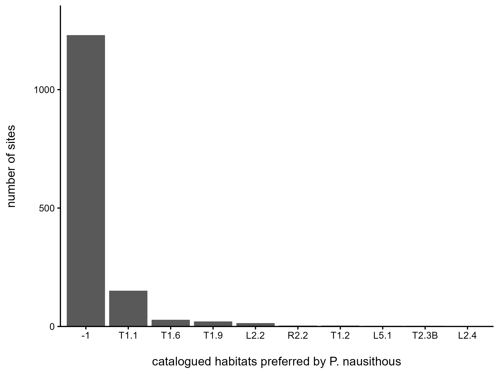
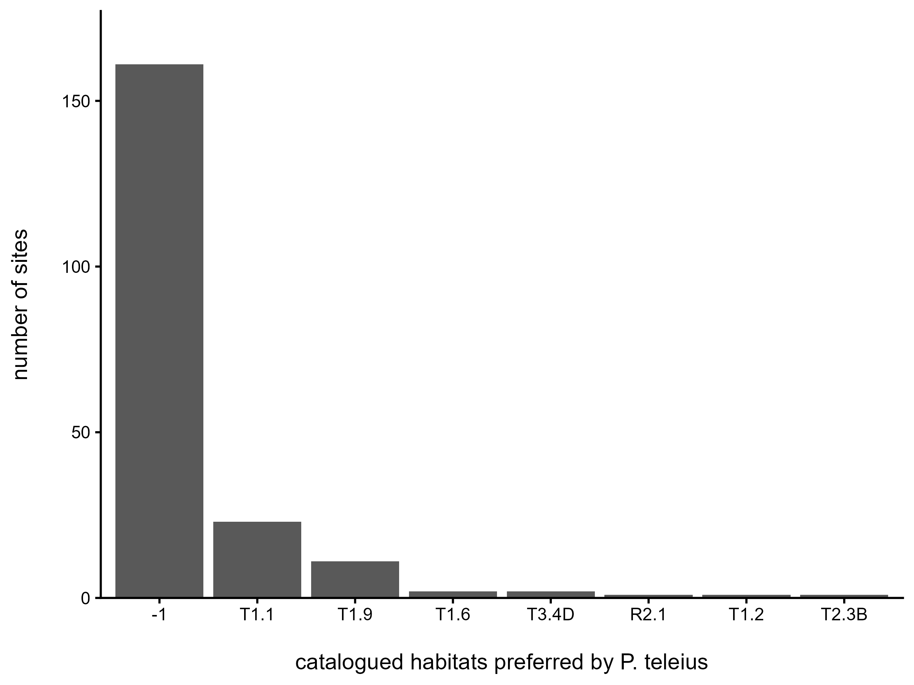
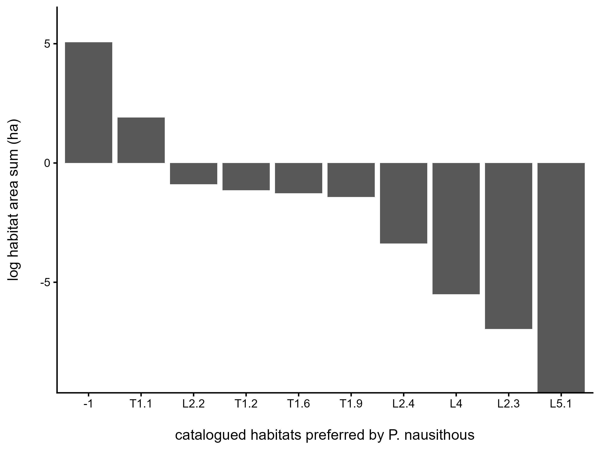
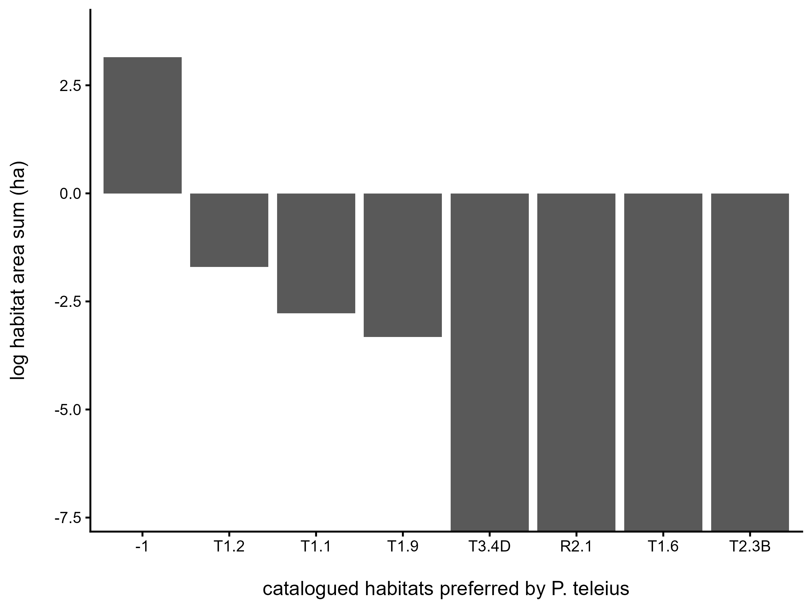

# Step 06 - Habitat attributes

_Generated 2026-09-05 23:07:33_

The cleaned occurrence records joined to the habitat mapping layer, one habitat segment per record. This produces data_analysis.csv, the table every model in steps 09 to 11 is fitted on.

**Table - Coverage of the habitat variables in the analysis table**

| variable | records_with_value | records_total | percent |
|---|---|---|---|
| AREA_SITE | 4540 | 4540 | 100 |
| BIOTOP | 684 | 4540 | 15.1 |
| FSB | 4540 | 4540 | 100 |
| HET_OUT | 4540 | 4540 | 100 |

Full table: [`06_habitat_coverage.csv`](../Tables/06_habitat_coverage.csv)

**Table - Mapped habitats at occupied P. nausithous sites**

| BIOTOP | AREA | mean_area | median_area | COUNT |
|---|---|---|---|---|
| -1 | 157.5 | 1280 | 25.11 | 1230 |
| T1.1 | 6.761 | 447.8 | 0 | 151 |
| T1.6 | 0.2823 | 100.8 | 0 | 28 |
| T1.9 | 0.2415 | 115 | 0 | 21 |
| L2.2 | 0.4092 | 292.3 | 0 | 14 |
| R2.2 | 0 | 0 | 0 | 4 |
| T1.2 | 0.3175 | 793.8 | 82.27 | 4 |
| L5.1 | 6.538e-05 | 0.2179 | 0 | 3 |
| T2.3B | 0 | 0 | 0 | 3 |
| L2.4 | 0.03412 | 170.6 | 170.6 | 2 |
| R2.1 | 0 | 0 | 0 | 2 |
| L10.2 | 0 | 0 | 0 | 1 |
| L2.3 | 0.0009515 | 9.515 | 9.515 | 1 |
| L3.1 | 0 | 0 | 0 | 1 |
| L3.3B | 0 | 0 | 0 | 1 |
| L4 | 0.004093 | 40.93 | 40.93 | 1 |
| V1F | 0 | 0 | 0 | 1 |
| V4A | 0 | 0 | 0 | 1 |

Full table: [`06_mapped_habitats_nausithous.csv`](../Tables/06_mapped_habitats_nausithous.csv)

**Table - Mapped habitats at occupied P. teleius sites**

| BIOTOP | AREA | mean_area | median_area | COUNT |
|---|---|---|---|---|
| -1 | 23.3 | 1447 | 17.69 | 161 |
| T1.1 | 0.06219 | 27.04 | 0 | 23 |
| T1.9 | 0.03616 | 32.87 | 0 | 11 |
| T1.6 | 0 | 0 | 0 | 2 |
| T3.4D | 0.0003998 | 1.999 | 1.999 | 2 |
| R2.1 | 0 | 0 | 0 | 1 |
| T1.2 | 0.1823 | 1823 | 1823 | 1 |
| T2.3B | 0 | 0 | 0 | 1 |

Full table: [`06_mapped_habitats_teleius.csv`](../Tables/06_mapped_habitats_teleius.csv)

**Figure - Catalogued habitats at occupied P. nausithous sites**

**Figure - Catalogued habitats at occupied P. teleius sites**

**Figure - Habitat area at occupied P. nausithous sites**

**Figure - Habitat area at occupied P. teleius sites**

## Segment selection rule

> **Note.** The rule is carried over unchanged from the original script: `arrange(NATURAL, AREA_SITE) %>% slice(1)`. Both keys sort ascending, so the segment kept for each record is the *least* natural and, among those, the *smallest*. If the intention was to describe each site by its most natural and largest habitat patch, the keys need `desc(NATURAL), desc(AREA_SITE)`. This was left as it stands because changing it would change every habitat model.

> **Note.** The direction of that sort has a large effect. NATURAL is defined by BIOTOP being present and not an X code, so ordering it ascending prefers a segment with no habitat code whenever the site has one. After the selection only 684 of 4540 records (15.1%) still carry a BIOTOP value, and the models using BIOTOP are fitted on that subset alone. Reversing the sort to `desc(NATURAL)` would keep the mapped habitat wherever one exists. This is a decision about the manuscript, not a bug, so the rule is left as written.

**Table - Selected segments: natural habitat flag against presence of a habitat code**

| NATURAL | BIOTOP_present | Freq |
|---|---|---|
| 0 | FALSE | 3856 |
| 1 | FALSE | 0 |
| 0 | TRUE | 0 |
| 1 | TRUE | 684 |

Full table: [`06_natural_vs_biotop.csv`](../Tables/06_natural_vs_biotop.csv)

**Table - Records by whether the selected segment is a natural habitat**

| NATURAL | records |
|---|---|
| 0 | 3856 |
| 1 | 684 |

Full table: [`06_natural_habitat_share.csv`](../Tables/06_natural_habitat_share.csv)

