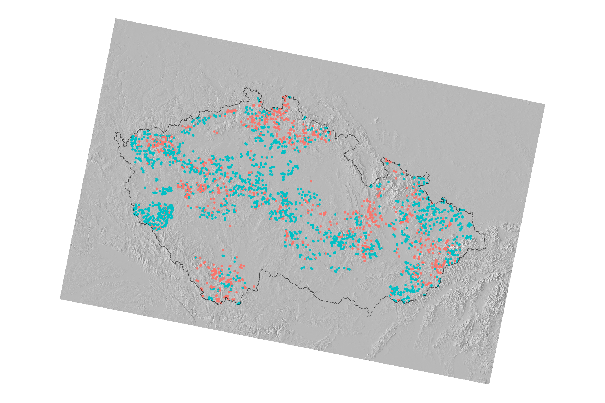
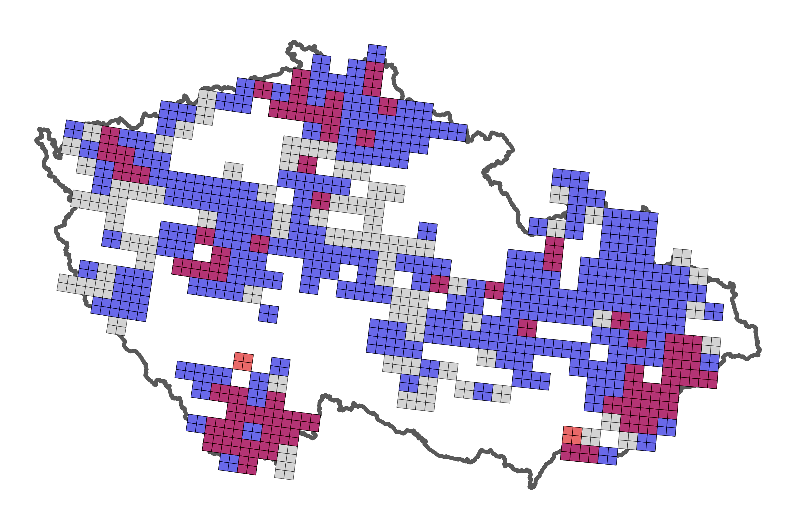

# Step 14 - Maps

_Generated 2026-09-05 23:11:05_

Distribution of the monitored sites and of the two species across the national mapping grid.

**Figure - Monitored sites on shaded relief**

**Figure - Mapping fields surveyed (grey), with P. nausithous (blue) and P. teleius (red)**

**Table - Mapping grid coverage**

| subset | fields |
|---|---|
| mapping fields surveyed | 364 |
| mapping fields with P. nausithous | 283 |
| mapping fields with P. teleius | 71 |

Full table: [`14_grid_coverage.csv`](../Tables/14_grid_coverage.csv)

The grid map previously referenced an object called `czechia`, which was never created, and printed an undefined `both_dist`. It now uses `czechia_border` from step 01, and the stray reference is gone.

> **Note.** The relief map drew the shaded-relief raster without reprojecting it. The relief is delivered in WGS84 degrees while every other layer is in S-JTSK metres, and geom_raster() plots raw coordinates, so the two ended up in unrelated coordinate ranges: the raster never appeared and the country was squeezed into a corner. The raster is now projected to S-JTSK first. Its legend, which was labelled elevation but held shading intensity between 0 and 1, has been dropped.

> **Note.** The grid map also matched the four-digit SITMAP code in the occurrence data against POLE in the grid layer, which identifies a quadrant of a basic field and always carries a letter suffix. Nothing ever matched, so the map came out as an empty outline. It now matches on the first four characters of POLE, which resolves all 364 surveyed fields to 1456 quadrants.

